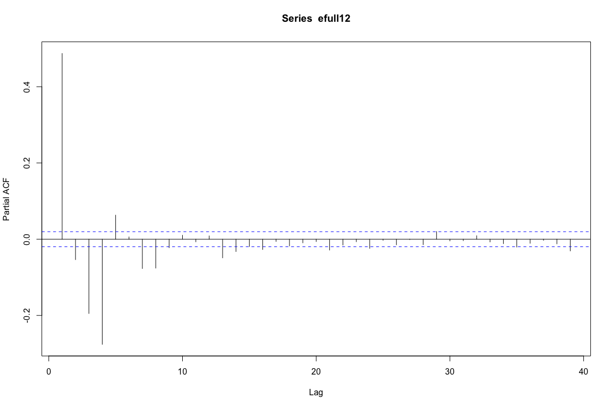

```r
knitr::opts_chunk$set(echo = TRUE,
                      warning = FALSE,
                      message = FALSE,
                      fig.path = "res-emotion-figs/",
                      fig.width = 12,
                      fig.height = 8)

library(nlme)
library(tidyverse)
```

```
## ── Attaching packages ──────────────────────────────── tidyverse 1.2.1 ──
```

```
## ✔ ggplot2 3.1.0     ✔ purrr   0.2.5
## ✔ tibble  2.0.1     ✔ dplyr   0.7.8
## ✔ tidyr   0.8.2     ✔ stringr 1.4.0
## ✔ readr   1.3.1     ✔ forcats 0.3.0
```

```
## ── Conflicts ─────────────────────────────────── tidyverse_conflicts() ──
## ✖ dplyr::collapse() masks nlme::collapse()
## ✖ dplyr::filter()   masks stats::filter()
## ✖ dplyr::lag()      masks stats::lag()
```

```r
library(broom.mixed)
```

```
## Warning in checkMatrixPackageVersion(): Package version inconsistency detected.
## TMB was built with Matrix version 1.2.14
## Current Matrix version is 1.2.15
## Please re-install 'TMB' from source using install.packages('TMB', type = 'source') or ask CRAN for a binary version of 'TMB' matching CRAN's 'Matrix' package
```

```r
library(knitr)
library(kableExtra)

res_q <- read_csv("/Users/Ben/Dropbox/PhD/Research/Support Self Reg/analyses/clean files/res_q_clean.csv")
```

```
## Parsed with column specification:
## cols(
##   .default = col_double(),
##   ra = col_character(),
##   date = col_character(),
##   start.time = col_character(),
##   ra.notes = col_character(),
##   ben.notes = col_character(),
##   startdate_q1 = col_datetime(format = ""),
##   enddate_q1 = col_datetime(format = ""),
##   c_couple_status = col_character(),
##   c_rel = col_character(),
##   c_rel_family = col_character(),
##   c_rel_family_other = col_character(),
##   c_rel_other = col_character(),
##   others_initial = col_character(),
##   rel_prompt_1 = col_character(),
##   rel_prompt_2 = col_character(),
##   rel_prompt_3 = col_character(),
##   rel_prompt_4 = col_character(),
##   talk_freq = col_character(),
##   startdate_q2 = col_datetime(format = ""),
##   enddate_q2 = col_datetime(format = "")
##   # ... with 15 more columns
## )
```

```
## See spec(...) for full column specifications.
```

```r
emotion <- read_csv("/Users/Ben/Dropbox/PhD/Research/Support Self Reg/analyses/clean files/res_emo_clean.csv")
```

```
## Parsed with column specification:
## cols(
##   id = col_double(),
##   block = col_double(),
##   trialnumber = col_double(),
##   minute = col_double(),
##   type = col_character(),
##   rating = col_double(),
##   image = col_character()
## )
```

```r
emotion <- emotion %>% 
  mutate(d_reap_v_lneg = case_when(
    type == "reap" ~ 1,
    type == "lneg" ~ 0,
    TRUE ~ as.numeric(NA)
  ),
  d_lneg_v_lneu = case_when(
    type == "lneg" ~ 1,
    type == "lneu" ~ 0
  )
  )

res <- full_join(emotion,
                 select(res_q,
                        id,
                        condition,
                        rejfa_friend,
                        rejfa_partner_fight,
                        ladder,
                        socialdes),
                 by = "id")

# kable style
print_kable <- function(table) {
  kable(table) %>% 
    kable_styling(full_width = FALSE)
}
```

# checking auto correlation on an intercept only model


```r
emo_fit00 <- lme(rating ~ 1,
                random = ~ 1|id,
                data = emotion,
                na.action = na.omit)

# autocorr_search <- map(1:20,
#     ~ lme(rating ~ 1,
#           random = ~ 1|id,
#           correlation = corARMA(
#             p = .x,
#             form = ~ trialnumber | id),
#           data = emotion,
#           na.action = na.omit))
# 
# write_rds(autocorr_search,
#           "/Users/Ben/Dropbox/PhD/Research/Support Self Reg/analyses/autocorr_search.rds")

autocorr_search <- read_rds("/Users/Ben/Dropbox/PhD/Research/Support Self Reg/analyses/autocorr_search.rds")

autocorr_search <- append(list(emo_fit00), autocorr_search)

# from https://stackoverflow.com/a/43436211/
ar_lrt <- eval(
  parse(
    text = paste(
      "anova(",
      paste("autocorr_search[[",
            1:length(autocorr_search),
            "]]",
            sep = "",
            collapse = ",")
      ,")")
    )
  ) %>% 
  as_tibble() %>% 
  mutate(call = (1:n()) -1) %>% 
  rename(ar = call) %>% 
  mutate(p.adj = p.adjust(`p-value`, method = "fdr"))

print_kable(ar_lrt)
```

<table class="table" style="width: auto !important; margin-left: auto; margin-right: auto;">
 <thead>
  <tr>
   <th style="text-align:right;"> ar </th>
   <th style="text-align:right;"> Model </th>
   <th style="text-align:right;"> df </th>
   <th style="text-align:right;"> AIC </th>
   <th style="text-align:right;"> BIC </th>
   <th style="text-align:right;"> logLik </th>
   <th style="text-align:left;"> Test </th>
   <th style="text-align:right;"> L.Ratio </th>
   <th style="text-align:right;"> p-value </th>
   <th style="text-align:right;"> p.adj </th>
  </tr>
 </thead>
<tbody>
  <tr>
   <td style="text-align:right;"> 0 </td>
   <td style="text-align:right;"> 1 </td>
   <td style="text-align:right;"> 3 </td>
   <td style="text-align:right;"> 33834.54 </td>
   <td style="text-align:right;"> 33856.07 </td>
   <td style="text-align:right;"> -16914.27 </td>
   <td style="text-align:left;">  </td>
   <td style="text-align:right;"> NA </td>
   <td style="text-align:right;"> NA </td>
   <td style="text-align:right;"> NA </td>
  </tr>
  <tr>
   <td style="text-align:right;"> 1 </td>
   <td style="text-align:right;"> 2 </td>
   <td style="text-align:right;"> 4 </td>
   <td style="text-align:right;"> 31050.09 </td>
   <td style="text-align:right;"> 31078.80 </td>
   <td style="text-align:right;"> -15521.05 </td>
   <td style="text-align:left;"> 1 vs 2 </td>
   <td style="text-align:right;"> 2786.4485157 </td>
   <td style="text-align:right;"> 0.0000000 </td>
   <td style="text-align:right;"> 0.0000000 </td>
  </tr>
  <tr>
   <td style="text-align:right;"> 2 </td>
   <td style="text-align:right;"> 3 </td>
   <td style="text-align:right;"> 5 </td>
   <td style="text-align:right;"> 31044.73 </td>
   <td style="text-align:right;"> 31080.61 </td>
   <td style="text-align:right;"> -15517.36 </td>
   <td style="text-align:left;"> 2 vs 3 </td>
   <td style="text-align:right;"> 7.3689890 </td>
   <td style="text-align:right;"> 0.0066358 </td>
   <td style="text-align:right;"> 0.0147463 </td>
  </tr>
  <tr>
   <td style="text-align:right;"> 3 </td>
   <td style="text-align:right;"> 4 </td>
   <td style="text-align:right;"> 6 </td>
   <td style="text-align:right;"> 30753.40 </td>
   <td style="text-align:right;"> 30796.46 </td>
   <td style="text-align:right;"> -15370.70 </td>
   <td style="text-align:left;"> 3 vs 4 </td>
   <td style="text-align:right;"> 293.3255447 </td>
   <td style="text-align:right;"> 0.0000000 </td>
   <td style="text-align:right;"> 0.0000000 </td>
  </tr>
  <tr>
   <td style="text-align:right;"> 4 </td>
   <td style="text-align:right;"> 5 </td>
   <td style="text-align:right;"> 7 </td>
   <td style="text-align:right;"> 30070.19 </td>
   <td style="text-align:right;"> 30120.43 </td>
   <td style="text-align:right;"> -15028.10 </td>
   <td style="text-align:left;"> 4 vs 5 </td>
   <td style="text-align:right;"> 685.2091220 </td>
   <td style="text-align:right;"> 0.0000000 </td>
   <td style="text-align:right;"> 0.0000000 </td>
  </tr>
  <tr>
   <td style="text-align:right;"> 5 </td>
   <td style="text-align:right;"> 6 </td>
   <td style="text-align:right;"> 8 </td>
   <td style="text-align:right;"> 30028.26 </td>
   <td style="text-align:right;"> 30085.67 </td>
   <td style="text-align:right;"> -15006.13 </td>
   <td style="text-align:left;"> 5 vs 6 </td>
   <td style="text-align:right;"> 43.9323905 </td>
   <td style="text-align:right;"> 0.0000000 </td>
   <td style="text-align:right;"> 0.0000000 </td>
  </tr>
  <tr>
   <td style="text-align:right;"> 6 </td>
   <td style="text-align:right;"> 7 </td>
   <td style="text-align:right;"> 9 </td>
   <td style="text-align:right;"> 30026.48 </td>
   <td style="text-align:right;"> 30091.07 </td>
   <td style="text-align:right;"> -15004.24 </td>
   <td style="text-align:left;"> 6 vs 7 </td>
   <td style="text-align:right;"> 3.7795590 </td>
   <td style="text-align:right;"> 0.0518823 </td>
   <td style="text-align:right;"> 0.0741176 </td>
  </tr>
  <tr>
   <td style="text-align:right;"> 7 </td>
   <td style="text-align:right;"> 8 </td>
   <td style="text-align:right;"> 10 </td>
   <td style="text-align:right;"> 29990.39 </td>
   <td style="text-align:right;"> 30062.16 </td>
   <td style="text-align:right;"> -14985.19 </td>
   <td style="text-align:left;"> 7 vs 8 </td>
   <td style="text-align:right;"> 38.0893247 </td>
   <td style="text-align:right;"> 0.0000000 </td>
   <td style="text-align:right;"> 0.0000000 </td>
  </tr>
  <tr>
   <td style="text-align:right;"> 8 </td>
   <td style="text-align:right;"> 9 </td>
   <td style="text-align:right;"> 11 </td>
   <td style="text-align:right;"> 29957.56 </td>
   <td style="text-align:right;"> 30036.51 </td>
   <td style="text-align:right;"> -14967.78 </td>
   <td style="text-align:left;"> 8 vs 9 </td>
   <td style="text-align:right;"> 34.8291680 </td>
   <td style="text-align:right;"> 0.0000000 </td>
   <td style="text-align:right;"> 0.0000000 </td>
  </tr>
  <tr>
   <td style="text-align:right;"> 9 </td>
   <td style="text-align:right;"> 10 </td>
   <td style="text-align:right;"> 12 </td>
   <td style="text-align:right;"> 29955.69 </td>
   <td style="text-align:right;"> 30041.81 </td>
   <td style="text-align:right;"> -14965.84 </td>
   <td style="text-align:left;"> 9 vs 10 </td>
   <td style="text-align:right;"> 3.8735001 </td>
   <td style="text-align:right;"> 0.0490541 </td>
   <td style="text-align:right;"> 0.0741176 </td>
  </tr>
  <tr>
   <td style="text-align:right;"> 10 </td>
   <td style="text-align:right;"> 11 </td>
   <td style="text-align:right;"> 13 </td>
   <td style="text-align:right;"> 29951.19 </td>
   <td style="text-align:right;"> 30044.49 </td>
   <td style="text-align:right;"> -14962.59 </td>
   <td style="text-align:left;"> 10 vs 11 </td>
   <td style="text-align:right;"> 6.4978962 </td>
   <td style="text-align:right;"> 0.0108002 </td>
   <td style="text-align:right;"> 0.0216004 </td>
  </tr>
  <tr>
   <td style="text-align:right;"> 11 </td>
   <td style="text-align:right;"> 12 </td>
   <td style="text-align:right;"> 14 </td>
   <td style="text-align:right;"> 29951.48 </td>
   <td style="text-align:right;"> 30051.95 </td>
   <td style="text-align:right;"> -14961.74 </td>
   <td style="text-align:left;"> 11 vs 12 </td>
   <td style="text-align:right;"> 1.7108979 </td>
   <td style="text-align:right;"> 0.1908689 </td>
   <td style="text-align:right;"> 0.2245517 </td>
  </tr>
  <tr>
   <td style="text-align:right;"> 12 </td>
   <td style="text-align:right;"> 13 </td>
   <td style="text-align:right;"> 15 </td>
   <td style="text-align:right;"> 29930.21 </td>
   <td style="text-align:right;"> 30037.86 </td>
   <td style="text-align:right;"> -14950.11 </td>
   <td style="text-align:left;"> 12 vs 13 </td>
   <td style="text-align:right;"> 23.2669052 </td>
   <td style="text-align:right;"> 0.0000014 </td>
   <td style="text-align:right;"> 0.0000040 </td>
  </tr>
  <tr>
   <td style="text-align:right;"> 13 </td>
   <td style="text-align:right;"> 14 </td>
   <td style="text-align:right;"> 16 </td>
   <td style="text-align:right;"> 29917.55 </td>
   <td style="text-align:right;"> 30032.38 </td>
   <td style="text-align:right;"> -14942.78 </td>
   <td style="text-align:left;"> 13 vs 14 </td>
   <td style="text-align:right;"> 14.6582914 </td>
   <td style="text-align:right;"> 0.0001289 </td>
   <td style="text-align:right;"> 0.0003222 </td>
  </tr>
  <tr>
   <td style="text-align:right;"> 14 </td>
   <td style="text-align:right;"> 15 </td>
   <td style="text-align:right;"> 17 </td>
   <td style="text-align:right;"> 29917.24 </td>
   <td style="text-align:right;"> 30039.24 </td>
   <td style="text-align:right;"> -14941.62 </td>
   <td style="text-align:left;"> 14 vs 15 </td>
   <td style="text-align:right;"> 2.3162663 </td>
   <td style="text-align:right;"> 0.1280270 </td>
   <td style="text-align:right;"> 0.1600338 </td>
  </tr>
  <tr>
   <td style="text-align:right;"> 15 </td>
   <td style="text-align:right;"> 16 </td>
   <td style="text-align:right;"> 18 </td>
   <td style="text-align:right;"> 29914.68 </td>
   <td style="text-align:right;"> 30043.86 </td>
   <td style="text-align:right;"> -14939.34 </td>
   <td style="text-align:left;"> 15 vs 16 </td>
   <td style="text-align:right;"> 4.5584452 </td>
   <td style="text-align:right;"> 0.0327568 </td>
   <td style="text-align:right;"> 0.0545947 </td>
  </tr>
  <tr>
   <td style="text-align:right;"> 16 </td>
   <td style="text-align:right;"> 17 </td>
   <td style="text-align:right;"> 19 </td>
   <td style="text-align:right;"> 29910.37 </td>
   <td style="text-align:right;"> 30046.73 </td>
   <td style="text-align:right;"> -14936.18 </td>
   <td style="text-align:left;"> 16 vs 17 </td>
   <td style="text-align:right;"> 6.3095826 </td>
   <td style="text-align:right;"> 0.0120087 </td>
   <td style="text-align:right;"> 0.0218340 </td>
  </tr>
  <tr>
   <td style="text-align:right;"> 17 </td>
   <td style="text-align:right;"> 18 </td>
   <td style="text-align:right;"> 20 </td>
   <td style="text-align:right;"> 29910.94 </td>
   <td style="text-align:right;"> 30054.48 </td>
   <td style="text-align:right;"> -14935.47 </td>
   <td style="text-align:left;"> 17 vs 18 </td>
   <td style="text-align:right;"> 1.4293526 </td>
   <td style="text-align:right;"> 0.2318701 </td>
   <td style="text-align:right;"> 0.2576335 </td>
  </tr>
  <tr>
   <td style="text-align:right;"> 18 </td>
   <td style="text-align:right;"> 19 </td>
   <td style="text-align:right;"> 21 </td>
   <td style="text-align:right;"> 29910.54 </td>
   <td style="text-align:right;"> 30061.25 </td>
   <td style="text-align:right;"> -14934.27 </td>
   <td style="text-align:left;"> 18 vs 19 </td>
   <td style="text-align:right;"> 2.4017263 </td>
   <td style="text-align:right;"> 0.1212014 </td>
   <td style="text-align:right;"> 0.1600338 </td>
  </tr>
  <tr>
   <td style="text-align:right;"> 19 </td>
   <td style="text-align:right;"> 20 </td>
   <td style="text-align:right;"> 22 </td>
   <td style="text-align:right;"> 29912.20 </td>
   <td style="text-align:right;"> 30070.09 </td>
   <td style="text-align:right;"> -14934.10 </td>
   <td style="text-align:left;"> 19 vs 20 </td>
   <td style="text-align:right;"> 0.3388870 </td>
   <td style="text-align:right;"> 0.5604724 </td>
   <td style="text-align:right;"> 0.5899709 </td>
  </tr>
  <tr>
   <td style="text-align:right;"> 20 </td>
   <td style="text-align:right;"> 21 </td>
   <td style="text-align:right;"> 23 </td>
   <td style="text-align:right;"> 29913.95 </td>
   <td style="text-align:right;"> 30079.02 </td>
   <td style="text-align:right;"> -14933.97 </td>
   <td style="text-align:left;"> 20 vs 21 </td>
   <td style="text-align:right;"> 0.2491482 </td>
   <td style="text-align:right;"> 0.6176755 </td>
   <td style="text-align:right;"> 0.6176755 </td>
  </tr>
</tbody>
</table>

AIC indicates model AR12 is the best


```r
# acf plots

# can't just use ACF on residuals because
# this doesn't keep track of missing values
# lme removes missing values
# need to add the missing values back to the residuals vector
# and tell the acf function to account for them in the ordering
# per Zhur 2009 p 147
# plot(ACF(emo_fit11, resType = "normalized"),
#      alpha = .05)

e1 <- residuals(autocorr_search[[1]],
               resType = "normalized")

# length(e1)
# length(emotion$rating)

enonmiss <- !is.na(res$rating)

efull1 <- vector(length = length(res$rating))
efull1 <- NA
efull1[enonmiss] <- e1

acf(efull1, na.action = na.pass)
```

<!-- -->

```r
pacf(efull1, na.action = na.pass)
```

<!-- -->

```r
e12 <- residuals(autocorr_search[[13]],
               resType = "normalized")
efull12 <- vector(length = length(res$rating))
efull12 <- NA
efull12[enonmiss] <- e12

acf(efull12, na.action = na.pass)
```

<!-- -->

```r
pacf(efull12, na.action = na.pass)
```

<!-- -->

```r
plot(ACF(autocorr_search[[5]],
         resType = "normalized",
         form = ~ trialnumber | id),
     alpha = .05)
```

<!-- -->

```r
pacf(residuals(autocorr_search[[1]],
          resType = "normalized"))
```

<!-- -->

# does reapraisal work? (Aim 3)


```r
emofit10 <- lme(rating ~ d_reap_v_lneg +
                   rejfa_friend + # control vars
                   rejfa_partner_fight +
                   ladder +
                   socialdes,
                random = ~ 1|id, # random int only
                data = res,
                na.action = na.omit)
summary(emofit10)
```

```
## Linear mixed-effects model fit by REML
##  Data: res 
##        AIC      BIC    logLik
##   17753.69 17807.71 -8868.845
## 
## Random effects:
##  Formula: ~1 | id
##         (Intercept)  Residual
## StdDev:   0.4878435 0.9444318
## 
## Fixed effects: rating ~ d_reap_v_lneg + rejfa_friend + rejfa_partner_fight +      ladder + socialdes 
##                         Value  Std.Error   DF   t-value p-value
## (Intercept)          3.566083 0.20924881 6132  17.04231  0.0000
## d_reap_v_lneg       -1.106409 0.02373925 6132 -46.60675  0.0000
## rejfa_friend         0.007948 0.00788427  198   1.00811  0.3146
## rejfa_partner_fight  0.010120 0.00509811  198   1.98506  0.0485
## ladder              -0.014762 0.02232529  198  -0.66120  0.5093
## socialdes            0.249499 0.18911389  198   1.31931  0.1886
##  Correlation: 
##                     (Intr) d_rp__ rjf_fr rjf_p_ ladder
## d_reap_v_lneg       -0.057                            
## rejfa_friend        -0.409  0.000                     
## rejfa_partner_fight -0.253  0.000 -0.302              
## ladder              -0.777  0.000  0.084  0.070       
## socialdes           -0.572  0.000  0.181  0.036  0.161
## 
## Standardized Within-Group Residuals:
##         Min          Q1         Med          Q3         Max 
## -3.56843892 -0.69550020  0.07115347  0.69801695  3.19612892 
## 
## Number of Observations: 6336
## Number of Groups: 203
```

```r
emofit11 <- update(emofit10,
                random = ~ d_reap_v_lneg|id) # random slope
summary(emofit11)
```

```
## Linear mixed-effects model fit by REML
##  Data: res 
##        AIC      BIC    logLik
##   17192.99 17260.52 -8586.494
## 
## Random effects:
##  Formula: ~d_reap_v_lneg | id
##  Structure: General positive-definite, Log-Cholesky parametrization
##               StdDev    Corr  
## (Intercept)   0.5978135 (Intr)
## d_reap_v_lneg 0.6958685 -0.566
## Residual      0.8758716       
## 
## Fixed effects: rating ~ d_reap_v_lneg + rejfa_friend + rejfa_partner_fight +      ladder + socialdes 
##                         Value  Std.Error   DF    t-value p-value
## (Intercept)          3.558640 0.21088414 6132  16.874859  0.0000
## d_reap_v_lneg       -1.101757 0.05359436 6132 -20.557342  0.0000
## rejfa_friend         0.007942 0.00789732  198   1.005665  0.3158
## rejfa_partner_fight  0.010158 0.00510644  198   1.989339  0.0480
## ladder              -0.014452 0.02236133  198  -0.646302  0.5188
## socialdes            0.256362 0.18942405  198   1.353377  0.1775
##  Correlation: 
##                     (Intr) d_rp__ rjf_fr rjf_p_ ladder
## d_reap_v_lneg       -0.124                            
## rejfa_friend        -0.407  0.000                     
## rejfa_partner_fight -0.251  0.000 -0.302              
## ladder              -0.773  0.000  0.084  0.070       
## socialdes           -0.569  0.000  0.181  0.036  0.161
## 
## Standardized Within-Group Residuals:
##          Min           Q1          Med           Q3          Max 
## -3.753227798 -0.658607994 -0.009528821  0.687171153  4.041586474 
## 
## Number of Observations: 6336
## Number of Groups: 203
```

```r
anova(emofit10, emofit11)
```

```
##          Model df      AIC      BIC    logLik   Test L.Ratio p-value
## emofit10     1  8 17753.69 17807.71 -8868.845                       
## emofit11     2 10 17192.99 17260.52 -8586.494 1 vs 2 564.702  <.0001
```

Random slopes are waranted


```r
# autocorr_search1 <- map(1:20,
#                        ~ lme(rating ~ d_reap_v_lneg +
#                                rejfa_friend + # control vars
#                                rejfa_partner_fight +
#                                ladder +
#                                socialdes,
#                              random = ~ d_reap_v_lneg |id,
#                              correlation = corARMA(
#                                p = .x,
#                                form = ~ trialnumber | id),
#                              data = res,
#                              na.action = na.omit))
# write_rds(autocorr_search1,
#           "/Users/Ben/Dropbox/PhD/Research/Support Self Reg/analyses/autocorr_search1.rds")

autocorr_search1 <- read_rds("/Users/Ben/Dropbox/PhD/Research/Support Self Reg/analyses/autocorr_search1.rds")

autocorr_search1 <- append(list(emofit11), autocorr_search1)

ar_lrt1 <- eval(
  parse(
    text = paste(
      "anova(",
      paste("autocorr_search1[[",
            1:length(autocorr_search1),
            "]]",
            sep = "",
            collapse = ",")
      ,")")
    )
  ) %>% 
  as_tibble() %>% 
  mutate(call = (1:n()) -1) %>% 
  rename(ar = call) %>% 
  mutate(p.adj = p.adjust(`p-value`, method = "fdr"))

print_kable(ar_lrt1)
```

<table class="table" style="width: auto !important; margin-left: auto; margin-right: auto;">
 <thead>
  <tr>
   <th style="text-align:right;"> ar </th>
   <th style="text-align:right;"> Model </th>
   <th style="text-align:right;"> df </th>
   <th style="text-align:right;"> AIC </th>
   <th style="text-align:right;"> BIC </th>
   <th style="text-align:right;"> logLik </th>
   <th style="text-align:left;"> Test </th>
   <th style="text-align:right;"> L.Ratio </th>
   <th style="text-align:right;"> p-value </th>
   <th style="text-align:right;"> p.adj </th>
  </tr>
 </thead>
<tbody>
  <tr>
   <td style="text-align:right;"> 0 </td>
   <td style="text-align:right;"> 1 </td>
   <td style="text-align:right;"> 10 </td>
   <td style="text-align:right;"> 17192.99 </td>
   <td style="text-align:right;"> 17260.52 </td>
   <td style="text-align:right;"> -8586.494 </td>
   <td style="text-align:left;">  </td>
   <td style="text-align:right;"> NA </td>
   <td style="text-align:right;"> NA </td>
   <td style="text-align:right;"> NA </td>
  </tr>
  <tr>
   <td style="text-align:right;"> 1 </td>
   <td style="text-align:right;"> 2 </td>
   <td style="text-align:right;"> 11 </td>
   <td style="text-align:right;"> 17056.35 </td>
   <td style="text-align:right;"> 17130.63 </td>
   <td style="text-align:right;"> -8517.173 </td>
   <td style="text-align:left;"> 1 vs 2 </td>
   <td style="text-align:right;"> 138.6418684 </td>
   <td style="text-align:right;"> 0.0000000 </td>
   <td style="text-align:right;"> 0.0000000 </td>
  </tr>
  <tr>
   <td style="text-align:right;"> 2 </td>
   <td style="text-align:right;"> 3 </td>
   <td style="text-align:right;"> 12 </td>
   <td style="text-align:right;"> 17038.17 </td>
   <td style="text-align:right;"> 17119.21 </td>
   <td style="text-align:right;"> -8507.085 </td>
   <td style="text-align:left;"> 2 vs 3 </td>
   <td style="text-align:right;"> 20.1756527 </td>
   <td style="text-align:right;"> 0.0000071 </td>
   <td style="text-align:right;"> 0.0000706 </td>
  </tr>
  <tr>
   <td style="text-align:right;"> 3 </td>
   <td style="text-align:right;"> 4 </td>
   <td style="text-align:right;"> 13 </td>
   <td style="text-align:right;"> 17035.46 </td>
   <td style="text-align:right;"> 17123.25 </td>
   <td style="text-align:right;"> -8504.731 </td>
   <td style="text-align:left;"> 3 vs 4 </td>
   <td style="text-align:right;"> 4.7073673 </td>
   <td style="text-align:right;"> 0.0300336 </td>
   <td style="text-align:right;"> 0.1201344 </td>
  </tr>
  <tr>
   <td style="text-align:right;"> 4 </td>
   <td style="text-align:right;"> 5 </td>
   <td style="text-align:right;"> 14 </td>
   <td style="text-align:right;"> 17037.05 </td>
   <td style="text-align:right;"> 17131.59 </td>
   <td style="text-align:right;"> -8504.525 </td>
   <td style="text-align:left;"> 4 vs 5 </td>
   <td style="text-align:right;"> 0.4129262 </td>
   <td style="text-align:right;"> 0.5204880 </td>
   <td style="text-align:right;"> 0.7435543 </td>
  </tr>
  <tr>
   <td style="text-align:right;"> 5 </td>
   <td style="text-align:right;"> 6 </td>
   <td style="text-align:right;"> 15 </td>
   <td style="text-align:right;"> 17035.81 </td>
   <td style="text-align:right;"> 17137.10 </td>
   <td style="text-align:right;"> -8502.903 </td>
   <td style="text-align:left;"> 5 vs 6 </td>
   <td style="text-align:right;"> 3.2437761 </td>
   <td style="text-align:right;"> 0.0716952 </td>
   <td style="text-align:right;"> 0.2048435 </td>
  </tr>
  <tr>
   <td style="text-align:right;"> 6 </td>
   <td style="text-align:right;"> 7 </td>
   <td style="text-align:right;"> 16 </td>
   <td style="text-align:right;"> 17027.11 </td>
   <td style="text-align:right;"> 17135.16 </td>
   <td style="text-align:right;"> -8497.553 </td>
   <td style="text-align:left;"> 6 vs 7 </td>
   <td style="text-align:right;"> 10.6989243 </td>
   <td style="text-align:right;"> 0.0010720 </td>
   <td style="text-align:right;"> 0.0071465 </td>
  </tr>
  <tr>
   <td style="text-align:right;"> 7 </td>
   <td style="text-align:right;"> 8 </td>
   <td style="text-align:right;"> 17 </td>
   <td style="text-align:right;"> 17027.46 </td>
   <td style="text-align:right;"> 17142.27 </td>
   <td style="text-align:right;"> -8496.732 </td>
   <td style="text-align:left;"> 7 vs 8 </td>
   <td style="text-align:right;"> 1.6421253 </td>
   <td style="text-align:right;"> 0.2000341 </td>
   <td style="text-align:right;"> 0.4750634 </td>
  </tr>
  <tr>
   <td style="text-align:right;"> 8 </td>
   <td style="text-align:right;"> 9 </td>
   <td style="text-align:right;"> 18 </td>
   <td style="text-align:right;"> 17022.32 </td>
   <td style="text-align:right;"> 17143.88 </td>
   <td style="text-align:right;"> -8493.160 </td>
   <td style="text-align:left;"> 8 vs 9 </td>
   <td style="text-align:right;"> 7.1436659 </td>
   <td style="text-align:right;"> 0.0075229 </td>
   <td style="text-align:right;"> 0.0376146 </td>
  </tr>
  <tr>
   <td style="text-align:right;"> 9 </td>
   <td style="text-align:right;"> 10 </td>
   <td style="text-align:right;"> 19 </td>
   <td style="text-align:right;"> 17023.25 </td>
   <td style="text-align:right;"> 17151.55 </td>
   <td style="text-align:right;"> -8492.623 </td>
   <td style="text-align:left;"> 9 vs 10 </td>
   <td style="text-align:right;"> 1.0746384 </td>
   <td style="text-align:right;"> 0.2999001 </td>
   <td style="text-align:right;"> 0.5230656 </td>
  </tr>
  <tr>
   <td style="text-align:right;"> 10 </td>
   <td style="text-align:right;"> 11 </td>
   <td style="text-align:right;"> 20 </td>
   <td style="text-align:right;"> 17023.75 </td>
   <td style="text-align:right;"> 17158.81 </td>
   <td style="text-align:right;"> -8491.877 </td>
   <td style="text-align:left;"> 10 vs 11 </td>
   <td style="text-align:right;"> 1.4927089 </td>
   <td style="text-align:right;"> 0.2217966 </td>
   <td style="text-align:right;"> 0.4750634 </td>
  </tr>
  <tr>
   <td style="text-align:right;"> 11 </td>
   <td style="text-align:right;"> 12 </td>
   <td style="text-align:right;"> 21 </td>
   <td style="text-align:right;"> 17025.62 </td>
   <td style="text-align:right;"> 17167.44 </td>
   <td style="text-align:right;"> -8491.812 </td>
   <td style="text-align:left;"> 11 vs 12 </td>
   <td style="text-align:right;"> 0.1291231 </td>
   <td style="text-align:right;"> 0.7193430 </td>
   <td style="text-align:right;"> 0.7692999 </td>
  </tr>
  <tr>
   <td style="text-align:right;"> 12 </td>
   <td style="text-align:right;"> 13 </td>
   <td style="text-align:right;"> 22 </td>
   <td style="text-align:right;"> 17027.42 </td>
   <td style="text-align:right;"> 17175.99 </td>
   <td style="text-align:right;"> -8491.711 </td>
   <td style="text-align:left;"> 12 vs 13 </td>
   <td style="text-align:right;"> 0.2027447 </td>
   <td style="text-align:right;"> 0.6525145 </td>
   <td style="text-align:right;"> 0.7692999 </td>
  </tr>
  <tr>
   <td style="text-align:right;"> 13 </td>
   <td style="text-align:right;"> 14 </td>
   <td style="text-align:right;"> 23 </td>
   <td style="text-align:right;"> 17028.88 </td>
   <td style="text-align:right;"> 17184.20 </td>
   <td style="text-align:right;"> -8491.438 </td>
   <td style="text-align:left;"> 13 vs 14 </td>
   <td style="text-align:right;"> 0.5455649 </td>
   <td style="text-align:right;"> 0.4601355 </td>
   <td style="text-align:right;"> 0.7079008 </td>
  </tr>
  <tr>
   <td style="text-align:right;"> 14 </td>
   <td style="text-align:right;"> 15 </td>
   <td style="text-align:right;"> 24 </td>
   <td style="text-align:right;"> 17030.84 </td>
   <td style="text-align:right;"> 17192.91 </td>
   <td style="text-align:right;"> -8491.419 </td>
   <td style="text-align:left;"> 14 vs 15 </td>
   <td style="text-align:right;"> 0.0378600 </td>
   <td style="text-align:right;"> 0.8457246 </td>
   <td style="text-align:right;"> 0.8457246 </td>
  </tr>
  <tr>
   <td style="text-align:right;"> 15 </td>
   <td style="text-align:right;"> 16 </td>
   <td style="text-align:right;"> 25 </td>
   <td style="text-align:right;"> 17031.44 </td>
   <td style="text-align:right;"> 17200.27 </td>
   <td style="text-align:right;"> -8490.722 </td>
   <td style="text-align:left;"> 15 vs 16 </td>
   <td style="text-align:right;"> 1.3951832 </td>
   <td style="text-align:right;"> 0.2375317 </td>
   <td style="text-align:right;"> 0.4750634 </td>
  </tr>
  <tr>
   <td style="text-align:right;"> 16 </td>
   <td style="text-align:right;"> 17 </td>
   <td style="text-align:right;"> 26 </td>
   <td style="text-align:right;"> 17032.43 </td>
   <td style="text-align:right;"> 17208.01 </td>
   <td style="text-align:right;"> -8490.214 </td>
   <td style="text-align:left;"> 16 vs 17 </td>
   <td style="text-align:right;"> 1.0144489 </td>
   <td style="text-align:right;"> 0.3138394 </td>
   <td style="text-align:right;"> 0.5230656 </td>
  </tr>
  <tr>
   <td style="text-align:right;"> 17 </td>
   <td style="text-align:right;"> 18 </td>
   <td style="text-align:right;"> 27 </td>
   <td style="text-align:right;"> 17034.21 </td>
   <td style="text-align:right;"> 17216.54 </td>
   <td style="text-align:right;"> -8490.106 </td>
   <td style="text-align:left;"> 17 vs 18 </td>
   <td style="text-align:right;"> 0.2167143 </td>
   <td style="text-align:right;"> 0.6415549 </td>
   <td style="text-align:right;"> 0.7692999 </td>
  </tr>
  <tr>
   <td style="text-align:right;"> 18 </td>
   <td style="text-align:right;"> 19 </td>
   <td style="text-align:right;"> 28 </td>
   <td style="text-align:right;"> 17032.26 </td>
   <td style="text-align:right;"> 17221.34 </td>
   <td style="text-align:right;"> -8488.128 </td>
   <td style="text-align:left;"> 18 vs 19 </td>
   <td style="text-align:right;"> 3.9555734 </td>
   <td style="text-align:right;"> 0.0467164 </td>
   <td style="text-align:right;"> 0.1557213 </td>
  </tr>
  <tr>
   <td style="text-align:right;"> 19 </td>
   <td style="text-align:right;"> 20 </td>
   <td style="text-align:right;"> 29 </td>
   <td style="text-align:right;"> 17034.08 </td>
   <td style="text-align:right;"> 17229.92 </td>
   <td style="text-align:right;"> -8488.040 </td>
   <td style="text-align:left;"> 19 vs 20 </td>
   <td style="text-align:right;"> 0.1757904 </td>
   <td style="text-align:right;"> 0.6750161 </td>
   <td style="text-align:right;"> 0.7692999 </td>
  </tr>
  <tr>
   <td style="text-align:right;"> 20 </td>
   <td style="text-align:right;"> 21 </td>
   <td style="text-align:right;"> 30 </td>
   <td style="text-align:right;"> 17035.96 </td>
   <td style="text-align:right;"> 17238.55 </td>
   <td style="text-align:right;"> -8487.981 </td>
   <td style="text-align:left;"> 20 vs 21 </td>
   <td style="text-align:right;"> 0.1183465 </td>
   <td style="text-align:right;"> 0.7308349 </td>
   <td style="text-align:right;"> 0.7692999 </td>
  </tr>
</tbody>
</table>

Based on AIC ar8 is the best fit, although the gains are smaller compared to ar0 v ar1.


```r
emo_fit11_ar_tidied <- map_df(autocorr_search1, tidy) %>% 
  filter(term == "d_reap_v_lneg") %>% 
  mutate(ar = 0:(n()-1)) %>% 
  select(ar, everything(), -effect, -group)

print_kable(emo_fit11_ar_tidied)
```

<table class="table" style="width: auto !important; margin-left: auto; margin-right: auto;">
 <thead>
  <tr>
   <th style="text-align:right;"> ar </th>
   <th style="text-align:left;"> term </th>
   <th style="text-align:right;"> estimate </th>
   <th style="text-align:right;"> std.error </th>
   <th style="text-align:right;"> df </th>
   <th style="text-align:right;"> statistic </th>
   <th style="text-align:right;"> p.value </th>
  </tr>
 </thead>
<tbody>
  <tr>
   <td style="text-align:right;"> 0 </td>
   <td style="text-align:left;"> d_reap_v_lneg </td>
   <td style="text-align:right;"> -1.101757 </td>
   <td style="text-align:right;"> 0.0535944 </td>
   <td style="text-align:right;"> 6132 </td>
   <td style="text-align:right;"> -20.55734 </td>
   <td style="text-align:right;"> 0 </td>
  </tr>
  <tr>
   <td style="text-align:right;"> 1 </td>
   <td style="text-align:left;"> d_reap_v_lneg </td>
   <td style="text-align:right;"> -1.100714 </td>
   <td style="text-align:right;"> 0.0533200 </td>
   <td style="text-align:right;"> 6132 </td>
   <td style="text-align:right;"> -20.64356 </td>
   <td style="text-align:right;"> 0 </td>
  </tr>
  <tr>
   <td style="text-align:right;"> 2 </td>
   <td style="text-align:left;"> d_reap_v_lneg </td>
   <td style="text-align:right;"> -1.100018 </td>
   <td style="text-align:right;"> 0.0531954 </td>
   <td style="text-align:right;"> 6132 </td>
   <td style="text-align:right;"> -20.67881 </td>
   <td style="text-align:right;"> 0 </td>
  </tr>
  <tr>
   <td style="text-align:right;"> 3 </td>
   <td style="text-align:left;"> d_reap_v_lneg </td>
   <td style="text-align:right;"> -1.099586 </td>
   <td style="text-align:right;"> 0.0531938 </td>
   <td style="text-align:right;"> 6132 </td>
   <td style="text-align:right;"> -20.67132 </td>
   <td style="text-align:right;"> 0 </td>
  </tr>
  <tr>
   <td style="text-align:right;"> 4 </td>
   <td style="text-align:left;"> d_reap_v_lneg </td>
   <td style="text-align:right;"> -1.099300 </td>
   <td style="text-align:right;"> 0.0531780 </td>
   <td style="text-align:right;"> 6132 </td>
   <td style="text-align:right;"> -20.67206 </td>
   <td style="text-align:right;"> 0 </td>
  </tr>
  <tr>
   <td style="text-align:right;"> 5 </td>
   <td style="text-align:left;"> d_reap_v_lneg </td>
   <td style="text-align:right;"> -1.098785 </td>
   <td style="text-align:right;"> 0.0531684 </td>
   <td style="text-align:right;"> 6132 </td>
   <td style="text-align:right;"> -20.66611 </td>
   <td style="text-align:right;"> 0 </td>
  </tr>
  <tr>
   <td style="text-align:right;"> 6 </td>
   <td style="text-align:left;"> d_reap_v_lneg </td>
   <td style="text-align:right;"> -1.096576 </td>
   <td style="text-align:right;"> 0.0533232 </td>
   <td style="text-align:right;"> 6132 </td>
   <td style="text-align:right;"> -20.56473 </td>
   <td style="text-align:right;"> 0 </td>
  </tr>
  <tr>
   <td style="text-align:right;"> 7 </td>
   <td style="text-align:left;"> d_reap_v_lneg </td>
   <td style="text-align:right;"> -1.096203 </td>
   <td style="text-align:right;"> 0.0533069 </td>
   <td style="text-align:right;"> 6132 </td>
   <td style="text-align:right;"> -20.56401 </td>
   <td style="text-align:right;"> 0 </td>
  </tr>
  <tr>
   <td style="text-align:right;"> 8 </td>
   <td style="text-align:left;"> d_reap_v_lneg </td>
   <td style="text-align:right;"> -1.096187 </td>
   <td style="text-align:right;"> 0.0533279 </td>
   <td style="text-align:right;"> 6132 </td>
   <td style="text-align:right;"> -20.55559 </td>
   <td style="text-align:right;"> 0 </td>
  </tr>
  <tr>
   <td style="text-align:right;"> 9 </td>
   <td style="text-align:left;"> d_reap_v_lneg </td>
   <td style="text-align:right;"> -1.095848 </td>
   <td style="text-align:right;"> 0.0533332 </td>
   <td style="text-align:right;"> 6132 </td>
   <td style="text-align:right;"> -20.54720 </td>
   <td style="text-align:right;"> 0 </td>
  </tr>
  <tr>
   <td style="text-align:right;"> 10 </td>
   <td style="text-align:left;"> d_reap_v_lneg </td>
   <td style="text-align:right;"> -1.096825 </td>
   <td style="text-align:right;"> 0.0532610 </td>
   <td style="text-align:right;"> 6132 </td>
   <td style="text-align:right;"> -20.59341 </td>
   <td style="text-align:right;"> 0 </td>
  </tr>
  <tr>
   <td style="text-align:right;"> 11 </td>
   <td style="text-align:left;"> d_reap_v_lneg </td>
   <td style="text-align:right;"> -1.096632 </td>
   <td style="text-align:right;"> 0.0532630 </td>
   <td style="text-align:right;"> 6132 </td>
   <td style="text-align:right;"> -20.58898 </td>
   <td style="text-align:right;"> 0 </td>
  </tr>
  <tr>
   <td style="text-align:right;"> 12 </td>
   <td style="text-align:left;"> d_reap_v_lneg </td>
   <td style="text-align:right;"> -1.096781 </td>
   <td style="text-align:right;"> 0.0532694 </td>
   <td style="text-align:right;"> 6132 </td>
   <td style="text-align:right;"> -20.58931 </td>
   <td style="text-align:right;"> 0 </td>
  </tr>
  <tr>
   <td style="text-align:right;"> 13 </td>
   <td style="text-align:left;"> d_reap_v_lneg </td>
   <td style="text-align:right;"> -1.096491 </td>
   <td style="text-align:right;"> 0.0532610 </td>
   <td style="text-align:right;"> 6132 </td>
   <td style="text-align:right;"> -20.58713 </td>
   <td style="text-align:right;"> 0 </td>
  </tr>
  <tr>
   <td style="text-align:right;"> 14 </td>
   <td style="text-align:left;"> d_reap_v_lneg </td>
   <td style="text-align:right;"> -1.096468 </td>
   <td style="text-align:right;"> 0.0532576 </td>
   <td style="text-align:right;"> 6132 </td>
   <td style="text-align:right;"> -20.58799 </td>
   <td style="text-align:right;"> 0 </td>
  </tr>
  <tr>
   <td style="text-align:right;"> 15 </td>
   <td style="text-align:left;"> d_reap_v_lneg </td>
   <td style="text-align:right;"> -1.096009 </td>
   <td style="text-align:right;"> 0.0532555 </td>
   <td style="text-align:right;"> 6132 </td>
   <td style="text-align:right;"> -20.58019 </td>
   <td style="text-align:right;"> 0 </td>
  </tr>
  <tr>
   <td style="text-align:right;"> 16 </td>
   <td style="text-align:left;"> d_reap_v_lneg </td>
   <td style="text-align:right;"> -1.096490 </td>
   <td style="text-align:right;"> 0.0532521 </td>
   <td style="text-align:right;"> 6132 </td>
   <td style="text-align:right;"> -20.59057 </td>
   <td style="text-align:right;"> 0 </td>
  </tr>
  <tr>
   <td style="text-align:right;"> 17 </td>
   <td style="text-align:left;"> d_reap_v_lneg </td>
   <td style="text-align:right;"> -1.096551 </td>
   <td style="text-align:right;"> 0.0532423 </td>
   <td style="text-align:right;"> 6132 </td>
   <td style="text-align:right;"> -20.59551 </td>
   <td style="text-align:right;"> 0 </td>
  </tr>
  <tr>
   <td style="text-align:right;"> 18 </td>
   <td style="text-align:left;"> d_reap_v_lneg </td>
   <td style="text-align:right;"> -1.095747 </td>
   <td style="text-align:right;"> 0.0532638 </td>
   <td style="text-align:right;"> 6132 </td>
   <td style="text-align:right;"> -20.57208 </td>
   <td style="text-align:right;"> 0 </td>
  </tr>
  <tr>
   <td style="text-align:right;"> 19 </td>
   <td style="text-align:left;"> d_reap_v_lneg </td>
   <td style="text-align:right;"> -1.095722 </td>
   <td style="text-align:right;"> 0.0532665 </td>
   <td style="text-align:right;"> 6132 </td>
   <td style="text-align:right;"> -20.57058 </td>
   <td style="text-align:right;"> 0 </td>
  </tr>
  <tr>
   <td style="text-align:right;"> 20 </td>
   <td style="text-align:left;"> d_reap_v_lneg </td>
   <td style="text-align:right;"> -1.095843 </td>
   <td style="text-align:right;"> 0.0532634 </td>
   <td style="text-align:right;"> 6132 </td>
   <td style="text-align:right;"> -20.57402 </td>
   <td style="text-align:right;"> 0 </td>
  </tr>
</tbody>
</table>

```r
acf_plots <- map(c(1:3, 9),
    ~ autocorr_search1[[.x]] %>%              
    ACF(resType = "normalized",
         form = ~ trialnumber | id) %>% 
     plot(alpha = .05, main = paste("AR", as.character(.x - 1)))
)

acf_plots
```

```
## [[1]]
```

<!-- -->

```
## 
## [[2]]
```

<!-- -->

```
## 
## [[3]]
```

<!-- -->

```
## 
## [[4]]
```

<!-- -->

Std errors for param of interest are the same to 3 decimal points for AR1, AR2, AR8. So basically, AR1 is fine.
AR8 is a sensible fit because that is the structure we used in the experiment: blocks of 4 trials of the same condition, the same condition didn't repeat twice. So there's dependence up to 8 trials.

# does support lower reactivity? (Aim 1)


```r
emofit20 <- lme(rating ~ d_lneg_v_lneu * condition +
                   rejfa_friend + # control vars
                   rejfa_partner_fight +
                   ladder +
                   socialdes,
                random = ~ 1|id, # random int only
                data = res,
                na.action = na.omit)
summary(emofit20)
```

```
## Linear mixed-effects model fit by REML
##  Data: res 
##        AIC      BIC    logLik
##   15457.71 15525.32 -7718.856
## 
## Random effects:
##  Formula: ~1 | id
##         (Intercept)  Residual
## StdDev:   0.3217244 0.7848034
## 
## Fixed effects: rating ~ d_lneg_v_lneu * condition + rejfa_friend + rejfa_partner_fight +      ladder + socialdes 
##                              Value  Std.Error   DF  t-value p-value
## (Intercept)              1.0936170 0.14393654 6180  7.59791  0.0000
## d_lneg_v_lneu            2.4951938 0.02794256 6180 89.29725  0.0000
## condition               -0.0399336 0.05601350  197 -0.71293  0.4767
## rejfa_friend             0.0049588 0.00544791  197  0.91022  0.3638
## rejfa_partner_fight      0.0057439 0.00348860  197  1.64647  0.1013
## ladder                  -0.0096337 0.01531669  197 -0.62897  0.5301
## socialdes                0.1608284 0.13005587  197  1.23661  0.2177
## d_lneg_v_lneu:condition  0.1776435 0.03929682 6180  4.52056  0.0000
##  Correlation: 
##                         (Intr) d_ln__ condtn rjf_fr rjf_p_ ladder soclds
## d_lneg_v_lneu           -0.096                                          
## condition               -0.151  0.250                                   
## rejfa_friend            -0.422  0.000  0.169                            
## rejfa_partner_fight     -0.263 -0.001  0.112 -0.273                     
## ladder                  -0.741 -0.002 -0.130  0.057  0.052              
## socialdes               -0.537  0.000 -0.145  0.148  0.017  0.179       
## d_lneg_v_lneu:condition  0.067 -0.711 -0.351  0.000  0.000  0.002  0.000
## 
## Standardized Within-Group Residuals:
##         Min          Q1         Med          Q3         Max 
## -4.04444850 -0.52255034 -0.07628483  0.56443707  5.43390293 
## 
## Number of Observations: 6385
## Number of Groups: 203
```

```r
emofit21 <- update(emofit20,
                random = ~ d_lneg_v_lneu|id) # random slope
summary(emofit21)
```

```
## Linear mixed-effects model fit by REML
##  Data: res 
##        AIC      BIC    logLik
##   14589.26 14670.39 -7282.632
## 
## Random effects:
##  Formula: ~d_lneg_v_lneu | id
##  Structure: General positive-definite, Log-Cholesky parametrization
##               StdDev    Corr  
## (Intercept)   0.2112607 (Intr)
## d_lneg_v_lneu 0.6410334 -0.302
## Residual      0.7151374       
## 
## Fixed effects: rating ~ d_lneg_v_lneu * condition + rejfa_friend + rejfa_partner_fight +      ladder + socialdes 
##                              Value  Std.Error   DF  t-value p-value
## (Intercept)              1.2255662 0.10521848 6180 11.64782  0.0000
## d_lneg_v_lneu            2.4862831 0.06870391 6180 36.18838  0.0000
## condition               -0.0427110 0.04120694  197 -1.03650  0.3012
## rejfa_friend             0.0034504 0.00398619  197  0.86560  0.3878
## rejfa_partner_fight      0.0028035 0.00255120  197  1.09888  0.2732
## ladder                  -0.0101910 0.01120184  197 -0.90976  0.3641
## socialdes               -0.0115285 0.09507794  197 -0.12125  0.9036
## d_lneg_v_lneu:condition  0.1849304 0.09686603 6180  1.90914  0.0563
##  Correlation: 
##                         (Intr) d_ln__ condtn rjf_fr rjf_p_ ladder soclds
## d_lneg_v_lneu           -0.100                                          
## condition               -0.151  0.258                                   
## rejfa_friend            -0.422  0.000  0.167                            
## rejfa_partner_fight     -0.263  0.001  0.112 -0.273                     
## ladder                  -0.740 -0.002 -0.133  0.057  0.051              
## socialdes               -0.537 -0.001 -0.145  0.148  0.017  0.179       
## d_lneg_v_lneu:condition  0.070 -0.709 -0.363  0.000 -0.001  0.002  0.001
## 
## Standardized Within-Group Residuals:
##        Min         Q1        Med         Q3        Max 
## -4.6004756 -0.3812508 -0.1417523  0.5928553  5.1902017 
## 
## Number of Observations: 6385
## Number of Groups: 203
```

```r
anova(emofit20, emofit21)
```

```
##          Model df      AIC      BIC    logLik   Test  L.Ratio p-value
## emofit20     1 10 15457.71 15525.32 -7718.856                        
## emofit21     2 12 14589.26 14670.39 -7282.632 1 vs 2 872.4483  <.0001
```

Random slopes are waranted


```r
# autocorr_search2 <- map(1:20,
#                        ~ lme(rating ~ d_lneg_v_lneu * condition +
#                                rejfa_friend + # control vars
#                                rejfa_partner_fight +
#                                ladder +
#                                socialdes,
#                              random = ~ d_lneg_v_lneu|id,
#                              correlation = corARMA(
#                                p = .x,
#                                form = ~ trialnumber|id),
#                              data = res,
#                              na.action = na.omit))
# write_rds(autocorr_search2,
#           "/Users/Ben/Dropbox/PhD/Research/Support Self Reg/analyses/autocorr_search2.rds")

autocorr_search2 <- read_rds("/Users/Ben/Dropbox/PhD/Research/Support Self Reg/analyses/autocorr_search2.rds")

autocorr_search2 <- append(list(emofit21), autocorr_search2)

ar_lrt2 <- eval(
  parse(
    text = paste(
      "anova(",
      paste("autocorr_search1[[",
            1:length(autocorr_search1),
            "]]",
            sep = "",
            collapse = ",")
      ,")")
    )
  ) %>% 
  as_tibble() %>% 
  mutate(call = (1:n()) -1) %>% 
  rename(ar = call) %>% 
  mutate(p.adj = p.adjust(`p-value`, method = "fdr"))

print_kable(ar_lrt2)
```

<table class="table" style="width: auto !important; margin-left: auto; margin-right: auto;">
 <thead>
  <tr>
   <th style="text-align:right;"> ar </th>
   <th style="text-align:right;"> Model </th>
   <th style="text-align:right;"> df </th>
   <th style="text-align:right;"> AIC </th>
   <th style="text-align:right;"> BIC </th>
   <th style="text-align:right;"> logLik </th>
   <th style="text-align:left;"> Test </th>
   <th style="text-align:right;"> L.Ratio </th>
   <th style="text-align:right;"> p-value </th>
   <th style="text-align:right;"> p.adj </th>
  </tr>
 </thead>
<tbody>
  <tr>
   <td style="text-align:right;"> 0 </td>
   <td style="text-align:right;"> 1 </td>
   <td style="text-align:right;"> 10 </td>
   <td style="text-align:right;"> 17192.99 </td>
   <td style="text-align:right;"> 17260.52 </td>
   <td style="text-align:right;"> -8586.494 </td>
   <td style="text-align:left;">  </td>
   <td style="text-align:right;"> NA </td>
   <td style="text-align:right;"> NA </td>
   <td style="text-align:right;"> NA </td>
  </tr>
  <tr>
   <td style="text-align:right;"> 1 </td>
   <td style="text-align:right;"> 2 </td>
   <td style="text-align:right;"> 11 </td>
   <td style="text-align:right;"> 17056.35 </td>
   <td style="text-align:right;"> 17130.63 </td>
   <td style="text-align:right;"> -8517.173 </td>
   <td style="text-align:left;"> 1 vs 2 </td>
   <td style="text-align:right;"> 138.6418684 </td>
   <td style="text-align:right;"> 0.0000000 </td>
   <td style="text-align:right;"> 0.0000000 </td>
  </tr>
  <tr>
   <td style="text-align:right;"> 2 </td>
   <td style="text-align:right;"> 3 </td>
   <td style="text-align:right;"> 12 </td>
   <td style="text-align:right;"> 17038.17 </td>
   <td style="text-align:right;"> 17119.21 </td>
   <td style="text-align:right;"> -8507.085 </td>
   <td style="text-align:left;"> 2 vs 3 </td>
   <td style="text-align:right;"> 20.1756527 </td>
   <td style="text-align:right;"> 0.0000071 </td>
   <td style="text-align:right;"> 0.0000706 </td>
  </tr>
  <tr>
   <td style="text-align:right;"> 3 </td>
   <td style="text-align:right;"> 4 </td>
   <td style="text-align:right;"> 13 </td>
   <td style="text-align:right;"> 17035.46 </td>
   <td style="text-align:right;"> 17123.25 </td>
   <td style="text-align:right;"> -8504.731 </td>
   <td style="text-align:left;"> 3 vs 4 </td>
   <td style="text-align:right;"> 4.7073673 </td>
   <td style="text-align:right;"> 0.0300336 </td>
   <td style="text-align:right;"> 0.1201344 </td>
  </tr>
  <tr>
   <td style="text-align:right;"> 4 </td>
   <td style="text-align:right;"> 5 </td>
   <td style="text-align:right;"> 14 </td>
   <td style="text-align:right;"> 17037.05 </td>
   <td style="text-align:right;"> 17131.59 </td>
   <td style="text-align:right;"> -8504.525 </td>
   <td style="text-align:left;"> 4 vs 5 </td>
   <td style="text-align:right;"> 0.4129262 </td>
   <td style="text-align:right;"> 0.5204880 </td>
   <td style="text-align:right;"> 0.7435543 </td>
  </tr>
  <tr>
   <td style="text-align:right;"> 5 </td>
   <td style="text-align:right;"> 6 </td>
   <td style="text-align:right;"> 15 </td>
   <td style="text-align:right;"> 17035.81 </td>
   <td style="text-align:right;"> 17137.10 </td>
   <td style="text-align:right;"> -8502.903 </td>
   <td style="text-align:left;"> 5 vs 6 </td>
   <td style="text-align:right;"> 3.2437761 </td>
   <td style="text-align:right;"> 0.0716952 </td>
   <td style="text-align:right;"> 0.2048435 </td>
  </tr>
  <tr>
   <td style="text-align:right;"> 6 </td>
   <td style="text-align:right;"> 7 </td>
   <td style="text-align:right;"> 16 </td>
   <td style="text-align:right;"> 17027.11 </td>
   <td style="text-align:right;"> 17135.16 </td>
   <td style="text-align:right;"> -8497.553 </td>
   <td style="text-align:left;"> 6 vs 7 </td>
   <td style="text-align:right;"> 10.6989243 </td>
   <td style="text-align:right;"> 0.0010720 </td>
   <td style="text-align:right;"> 0.0071465 </td>
  </tr>
  <tr>
   <td style="text-align:right;"> 7 </td>
   <td style="text-align:right;"> 8 </td>
   <td style="text-align:right;"> 17 </td>
   <td style="text-align:right;"> 17027.46 </td>
   <td style="text-align:right;"> 17142.27 </td>
   <td style="text-align:right;"> -8496.732 </td>
   <td style="text-align:left;"> 7 vs 8 </td>
   <td style="text-align:right;"> 1.6421253 </td>
   <td style="text-align:right;"> 0.2000341 </td>
   <td style="text-align:right;"> 0.4750634 </td>
  </tr>
  <tr>
   <td style="text-align:right;"> 8 </td>
   <td style="text-align:right;"> 9 </td>
   <td style="text-align:right;"> 18 </td>
   <td style="text-align:right;"> 17022.32 </td>
   <td style="text-align:right;"> 17143.88 </td>
   <td style="text-align:right;"> -8493.160 </td>
   <td style="text-align:left;"> 8 vs 9 </td>
   <td style="text-align:right;"> 7.1436659 </td>
   <td style="text-align:right;"> 0.0075229 </td>
   <td style="text-align:right;"> 0.0376146 </td>
  </tr>
  <tr>
   <td style="text-align:right;"> 9 </td>
   <td style="text-align:right;"> 10 </td>
   <td style="text-align:right;"> 19 </td>
   <td style="text-align:right;"> 17023.25 </td>
   <td style="text-align:right;"> 17151.55 </td>
   <td style="text-align:right;"> -8492.623 </td>
   <td style="text-align:left;"> 9 vs 10 </td>
   <td style="text-align:right;"> 1.0746384 </td>
   <td style="text-align:right;"> 0.2999001 </td>
   <td style="text-align:right;"> 0.5230656 </td>
  </tr>
  <tr>
   <td style="text-align:right;"> 10 </td>
   <td style="text-align:right;"> 11 </td>
   <td style="text-align:right;"> 20 </td>
   <td style="text-align:right;"> 17023.75 </td>
   <td style="text-align:right;"> 17158.81 </td>
   <td style="text-align:right;"> -8491.877 </td>
   <td style="text-align:left;"> 10 vs 11 </td>
   <td style="text-align:right;"> 1.4927089 </td>
   <td style="text-align:right;"> 0.2217966 </td>
   <td style="text-align:right;"> 0.4750634 </td>
  </tr>
  <tr>
   <td style="text-align:right;"> 11 </td>
   <td style="text-align:right;"> 12 </td>
   <td style="text-align:right;"> 21 </td>
   <td style="text-align:right;"> 17025.62 </td>
   <td style="text-align:right;"> 17167.44 </td>
   <td style="text-align:right;"> -8491.812 </td>
   <td style="text-align:left;"> 11 vs 12 </td>
   <td style="text-align:right;"> 0.1291231 </td>
   <td style="text-align:right;"> 0.7193430 </td>
   <td style="text-align:right;"> 0.7692999 </td>
  </tr>
  <tr>
   <td style="text-align:right;"> 12 </td>
   <td style="text-align:right;"> 13 </td>
   <td style="text-align:right;"> 22 </td>
   <td style="text-align:right;"> 17027.42 </td>
   <td style="text-align:right;"> 17175.99 </td>
   <td style="text-align:right;"> -8491.711 </td>
   <td style="text-align:left;"> 12 vs 13 </td>
   <td style="text-align:right;"> 0.2027447 </td>
   <td style="text-align:right;"> 0.6525145 </td>
   <td style="text-align:right;"> 0.7692999 </td>
  </tr>
  <tr>
   <td style="text-align:right;"> 13 </td>
   <td style="text-align:right;"> 14 </td>
   <td style="text-align:right;"> 23 </td>
   <td style="text-align:right;"> 17028.88 </td>
   <td style="text-align:right;"> 17184.20 </td>
   <td style="text-align:right;"> -8491.438 </td>
   <td style="text-align:left;"> 13 vs 14 </td>
   <td style="text-align:right;"> 0.5455649 </td>
   <td style="text-align:right;"> 0.4601355 </td>
   <td style="text-align:right;"> 0.7079008 </td>
  </tr>
  <tr>
   <td style="text-align:right;"> 14 </td>
   <td style="text-align:right;"> 15 </td>
   <td style="text-align:right;"> 24 </td>
   <td style="text-align:right;"> 17030.84 </td>
   <td style="text-align:right;"> 17192.91 </td>
   <td style="text-align:right;"> -8491.419 </td>
   <td style="text-align:left;"> 14 vs 15 </td>
   <td style="text-align:right;"> 0.0378600 </td>
   <td style="text-align:right;"> 0.8457246 </td>
   <td style="text-align:right;"> 0.8457246 </td>
  </tr>
  <tr>
   <td style="text-align:right;"> 15 </td>
   <td style="text-align:right;"> 16 </td>
   <td style="text-align:right;"> 25 </td>
   <td style="text-align:right;"> 17031.44 </td>
   <td style="text-align:right;"> 17200.27 </td>
   <td style="text-align:right;"> -8490.722 </td>
   <td style="text-align:left;"> 15 vs 16 </td>
   <td style="text-align:right;"> 1.3951832 </td>
   <td style="text-align:right;"> 0.2375317 </td>
   <td style="text-align:right;"> 0.4750634 </td>
  </tr>
  <tr>
   <td style="text-align:right;"> 16 </td>
   <td style="text-align:right;"> 17 </td>
   <td style="text-align:right;"> 26 </td>
   <td style="text-align:right;"> 17032.43 </td>
   <td style="text-align:right;"> 17208.01 </td>
   <td style="text-align:right;"> -8490.214 </td>
   <td style="text-align:left;"> 16 vs 17 </td>
   <td style="text-align:right;"> 1.0144489 </td>
   <td style="text-align:right;"> 0.3138394 </td>
   <td style="text-align:right;"> 0.5230656 </td>
  </tr>
  <tr>
   <td style="text-align:right;"> 17 </td>
   <td style="text-align:right;"> 18 </td>
   <td style="text-align:right;"> 27 </td>
   <td style="text-align:right;"> 17034.21 </td>
   <td style="text-align:right;"> 17216.54 </td>
   <td style="text-align:right;"> -8490.106 </td>
   <td style="text-align:left;"> 17 vs 18 </td>
   <td style="text-align:right;"> 0.2167143 </td>
   <td style="text-align:right;"> 0.6415549 </td>
   <td style="text-align:right;"> 0.7692999 </td>
  </tr>
  <tr>
   <td style="text-align:right;"> 18 </td>
   <td style="text-align:right;"> 19 </td>
   <td style="text-align:right;"> 28 </td>
   <td style="text-align:right;"> 17032.26 </td>
   <td style="text-align:right;"> 17221.34 </td>
   <td style="text-align:right;"> -8488.128 </td>
   <td style="text-align:left;"> 18 vs 19 </td>
   <td style="text-align:right;"> 3.9555734 </td>
   <td style="text-align:right;"> 0.0467164 </td>
   <td style="text-align:right;"> 0.1557213 </td>
  </tr>
  <tr>
   <td style="text-align:right;"> 19 </td>
   <td style="text-align:right;"> 20 </td>
   <td style="text-align:right;"> 29 </td>
   <td style="text-align:right;"> 17034.08 </td>
   <td style="text-align:right;"> 17229.92 </td>
   <td style="text-align:right;"> -8488.040 </td>
   <td style="text-align:left;"> 19 vs 20 </td>
   <td style="text-align:right;"> 0.1757904 </td>
   <td style="text-align:right;"> 0.6750161 </td>
   <td style="text-align:right;"> 0.7692999 </td>
  </tr>
  <tr>
   <td style="text-align:right;"> 20 </td>
   <td style="text-align:right;"> 21 </td>
   <td style="text-align:right;"> 30 </td>
   <td style="text-align:right;"> 17035.96 </td>
   <td style="text-align:right;"> 17238.55 </td>
   <td style="text-align:right;"> -8487.981 </td>
   <td style="text-align:left;"> 20 vs 21 </td>
   <td style="text-align:right;"> 0.1183465 </td>
   <td style="text-align:right;"> 0.7308349 </td>
   <td style="text-align:right;"> 0.7692999 </td>
  </tr>
</tbody>
</table>

Based on AIC ar8 is again the best fit, although the gains are smaller compared to ar0 v ar1 and ar1 v ar2


```r
emo_fit21_ar_tidied <- tibble(ar = 0:(length(autocorr_search2) - 1),
                              autocorr = map(autocorr_search2, tidy)) %>%
  unnest(autocorr) %>% 
  filter(term %in% c(
    "d_lneg_v_lneu",
    "condition",
    "d_lneg_v_lneu:condition"
    )) %>% 
  select(-effect, -group)

print_kable(emo_fit21_ar_tidied)
```

<table class="table" style="width: auto !important; margin-left: auto; margin-right: auto;">
 <thead>
  <tr>
   <th style="text-align:right;"> ar </th>
   <th style="text-align:left;"> term </th>
   <th style="text-align:right;"> estimate </th>
   <th style="text-align:right;"> std.error </th>
   <th style="text-align:right;"> df </th>
   <th style="text-align:right;"> statistic </th>
   <th style="text-align:right;"> p.value </th>
  </tr>
 </thead>
<tbody>
  <tr>
   <td style="text-align:right;"> 0 </td>
   <td style="text-align:left;"> d_lneg_v_lneu </td>
   <td style="text-align:right;"> 2.4862831 </td>
   <td style="text-align:right;"> 0.0687039 </td>
   <td style="text-align:right;"> 6180 </td>
   <td style="text-align:right;"> 36.1883786 </td>
   <td style="text-align:right;"> 0.0000000 </td>
  </tr>
  <tr>
   <td style="text-align:right;"> 0 </td>
   <td style="text-align:left;"> condition </td>
   <td style="text-align:right;"> -0.0427110 </td>
   <td style="text-align:right;"> 0.0412069 </td>
   <td style="text-align:right;"> 197 </td>
   <td style="text-align:right;"> -1.0365013 </td>
   <td style="text-align:right;"> 0.3012389 </td>
  </tr>
  <tr>
   <td style="text-align:right;"> 0 </td>
   <td style="text-align:left;"> d_lneg_v_lneu:condition </td>
   <td style="text-align:right;"> 0.1849304 </td>
   <td style="text-align:right;"> 0.0968660 </td>
   <td style="text-align:right;"> 6180 </td>
   <td style="text-align:right;"> 1.9091354 </td>
   <td style="text-align:right;"> 0.0562909 </td>
  </tr>
  <tr>
   <td style="text-align:right;"> 1 </td>
   <td style="text-align:left;"> d_lneg_v_lneu </td>
   <td style="text-align:right;"> 2.4884664 </td>
   <td style="text-align:right;"> 0.0682311 </td>
   <td style="text-align:right;"> 6180 </td>
   <td style="text-align:right;"> 36.4711518 </td>
   <td style="text-align:right;"> 0.0000000 </td>
  </tr>
  <tr>
   <td style="text-align:right;"> 1 </td>
   <td style="text-align:left;"> condition </td>
   <td style="text-align:right;"> -0.0379362 </td>
   <td style="text-align:right;"> 0.0413160 </td>
   <td style="text-align:right;"> 197 </td>
   <td style="text-align:right;"> -0.9181964 </td>
   <td style="text-align:right;"> 0.3596389 </td>
  </tr>
  <tr>
   <td style="text-align:right;"> 1 </td>
   <td style="text-align:left;"> d_lneg_v_lneu:condition </td>
   <td style="text-align:right;"> 0.1751187 </td>
   <td style="text-align:right;"> 0.0961934 </td>
   <td style="text-align:right;"> 6180 </td>
   <td style="text-align:right;"> 1.8204861 </td>
   <td style="text-align:right;"> 0.0687333 </td>
  </tr>
  <tr>
   <td style="text-align:right;"> 2 </td>
   <td style="text-align:left;"> d_lneg_v_lneu </td>
   <td style="text-align:right;"> 2.4915909 </td>
   <td style="text-align:right;"> 0.0681140 </td>
   <td style="text-align:right;"> 6180 </td>
   <td style="text-align:right;"> 36.5797402 </td>
   <td style="text-align:right;"> 0.0000000 </td>
  </tr>
  <tr>
   <td style="text-align:right;"> 2 </td>
   <td style="text-align:left;"> condition </td>
   <td style="text-align:right;"> -0.0368530 </td>
   <td style="text-align:right;"> 0.0412289 </td>
   <td style="text-align:right;"> 197 </td>
   <td style="text-align:right;"> -0.8938637 </td>
   <td style="text-align:right;"> 0.3724856 </td>
  </tr>
  <tr>
   <td style="text-align:right;"> 2 </td>
   <td style="text-align:left;"> d_lneg_v_lneu:condition </td>
   <td style="text-align:right;"> 0.1743666 </td>
   <td style="text-align:right;"> 0.0960277 </td>
   <td style="text-align:right;"> 6180 </td>
   <td style="text-align:right;"> 1.8157947 </td>
   <td style="text-align:right;"> 0.0694503 </td>
  </tr>
  <tr>
   <td style="text-align:right;"> 3 </td>
   <td style="text-align:left;"> d_lneg_v_lneu </td>
   <td style="text-align:right;"> 2.4917494 </td>
   <td style="text-align:right;"> 0.0681123 </td>
   <td style="text-align:right;"> 6180 </td>
   <td style="text-align:right;"> 36.5829419 </td>
   <td style="text-align:right;"> 0.0000000 </td>
  </tr>
  <tr>
   <td style="text-align:right;"> 3 </td>
   <td style="text-align:left;"> condition </td>
   <td style="text-align:right;"> -0.0368501 </td>
   <td style="text-align:right;"> 0.0412186 </td>
   <td style="text-align:right;"> 197 </td>
   <td style="text-align:right;"> -0.8940161 </td>
   <td style="text-align:right;"> 0.3724042 </td>
  </tr>
  <tr>
   <td style="text-align:right;"> 3 </td>
   <td style="text-align:left;"> d_lneg_v_lneu:condition </td>
   <td style="text-align:right;"> 0.1744234 </td>
   <td style="text-align:right;"> 0.0960254 </td>
   <td style="text-align:right;"> 6180 </td>
   <td style="text-align:right;"> 1.8164287 </td>
   <td style="text-align:right;"> 0.0693531 </td>
  </tr>
  <tr>
   <td style="text-align:right;"> 4 </td>
   <td style="text-align:left;"> d_lneg_v_lneu </td>
   <td style="text-align:right;"> 2.4938777 </td>
   <td style="text-align:right;"> 0.0680513 </td>
   <td style="text-align:right;"> 6180 </td>
   <td style="text-align:right;"> 36.6470031 </td>
   <td style="text-align:right;"> 0.0000000 </td>
  </tr>
  <tr>
   <td style="text-align:right;"> 4 </td>
   <td style="text-align:left;"> condition </td>
   <td style="text-align:right;"> -0.0359156 </td>
   <td style="text-align:right;"> 0.0410881 </td>
   <td style="text-align:right;"> 197 </td>
   <td style="text-align:right;"> -0.8741098 </td>
   <td style="text-align:right;"> 0.3831228 </td>
  </tr>
  <tr>
   <td style="text-align:right;"> 4 </td>
   <td style="text-align:left;"> d_lneg_v_lneu:condition </td>
   <td style="text-align:right;"> 0.1732188 </td>
   <td style="text-align:right;"> 0.0959361 </td>
   <td style="text-align:right;"> 6180 </td>
   <td style="text-align:right;"> 1.8055634 </td>
   <td style="text-align:right;"> 0.0710352 </td>
  </tr>
  <tr>
   <td style="text-align:right;"> 5 </td>
   <td style="text-align:left;"> d_lneg_v_lneu </td>
   <td style="text-align:right;"> 2.4937471 </td>
   <td style="text-align:right;"> 0.0680551 </td>
   <td style="text-align:right;"> 6180 </td>
   <td style="text-align:right;"> 36.6430367 </td>
   <td style="text-align:right;"> 0.0000000 </td>
  </tr>
  <tr>
   <td style="text-align:right;"> 5 </td>
   <td style="text-align:left;"> condition </td>
   <td style="text-align:right;"> -0.0359705 </td>
   <td style="text-align:right;"> 0.0410927 </td>
   <td style="text-align:right;"> 197 </td>
   <td style="text-align:right;"> -0.8753511 </td>
   <td style="text-align:right;"> 0.3824489 </td>
  </tr>
  <tr>
   <td style="text-align:right;"> 5 </td>
   <td style="text-align:left;"> d_lneg_v_lneu:condition </td>
   <td style="text-align:right;"> 0.1733056 </td>
   <td style="text-align:right;"> 0.0959421 </td>
   <td style="text-align:right;"> 6180 </td>
   <td style="text-align:right;"> 1.8063567 </td>
   <td style="text-align:right;"> 0.0709113 </td>
  </tr>
  <tr>
   <td style="text-align:right;"> 6 </td>
   <td style="text-align:left;"> d_lneg_v_lneu </td>
   <td style="text-align:right;"> 2.4937604 </td>
   <td style="text-align:right;"> 0.0680551 </td>
   <td style="text-align:right;"> 6180 </td>
   <td style="text-align:right;"> 36.6432611 </td>
   <td style="text-align:right;"> 0.0000000 </td>
  </tr>
  <tr>
   <td style="text-align:right;"> 6 </td>
   <td style="text-align:left;"> condition </td>
   <td style="text-align:right;"> -0.0359816 </td>
   <td style="text-align:right;"> 0.0410946 </td>
   <td style="text-align:right;"> 197 </td>
   <td style="text-align:right;"> -0.8755790 </td>
   <td style="text-align:right;"> 0.3823252 </td>
  </tr>
  <tr>
   <td style="text-align:right;"> 6 </td>
   <td style="text-align:left;"> d_lneg_v_lneu:condition </td>
   <td style="text-align:right;"> 0.1733292 </td>
   <td style="text-align:right;"> 0.0959421 </td>
   <td style="text-align:right;"> 6180 </td>
   <td style="text-align:right;"> 1.8066029 </td>
   <td style="text-align:right;"> 0.0708728 </td>
  </tr>
  <tr>
   <td style="text-align:right;"> 7 </td>
   <td style="text-align:left;"> d_lneg_v_lneu </td>
   <td style="text-align:right;"> 2.4936207 </td>
   <td style="text-align:right;"> 0.0680683 </td>
   <td style="text-align:right;"> 6180 </td>
   <td style="text-align:right;"> 36.6341083 </td>
   <td style="text-align:right;"> 0.0000000 </td>
  </tr>
  <tr>
   <td style="text-align:right;"> 7 </td>
   <td style="text-align:left;"> condition </td>
   <td style="text-align:right;"> -0.0356835 </td>
   <td style="text-align:right;"> 0.0410860 </td>
   <td style="text-align:right;"> 197 </td>
   <td style="text-align:right;"> -0.8685077 </td>
   <td style="text-align:right;"> 0.3861733 </td>
  </tr>
  <tr>
   <td style="text-align:right;"> 7 </td>
   <td style="text-align:left;"> d_lneg_v_lneu:condition </td>
   <td style="text-align:right;"> 0.1728441 </td>
   <td style="text-align:right;"> 0.0959584 </td>
   <td style="text-align:right;"> 6180 </td>
   <td style="text-align:right;"> 1.8012394 </td>
   <td style="text-align:right;"> 0.0717139 </td>
  </tr>
  <tr>
   <td style="text-align:right;"> 8 </td>
   <td style="text-align:left;"> d_lneg_v_lneu </td>
   <td style="text-align:right;"> 2.4937886 </td>
   <td style="text-align:right;"> 0.0680652 </td>
   <td style="text-align:right;"> 6180 </td>
   <td style="text-align:right;"> 36.6382265 </td>
   <td style="text-align:right;"> 0.0000000 </td>
  </tr>
  <tr>
   <td style="text-align:right;"> 8 </td>
   <td style="text-align:left;"> condition </td>
   <td style="text-align:right;"> -0.0356467 </td>
   <td style="text-align:right;"> 0.0410800 </td>
   <td style="text-align:right;"> 197 </td>
   <td style="text-align:right;"> -0.8677394 </td>
   <td style="text-align:right;"> 0.3865928 </td>
  </tr>
  <tr>
   <td style="text-align:right;"> 8 </td>
   <td style="text-align:left;"> d_lneg_v_lneu:condition </td>
   <td style="text-align:right;"> 0.1728004 </td>
   <td style="text-align:right;"> 0.0959552 </td>
   <td style="text-align:right;"> 6180 </td>
   <td style="text-align:right;"> 1.8008447 </td>
   <td style="text-align:right;"> 0.0717761 </td>
  </tr>
  <tr>
   <td style="text-align:right;"> 9 </td>
   <td style="text-align:left;"> d_lneg_v_lneu </td>
   <td style="text-align:right;"> 2.4937409 </td>
   <td style="text-align:right;"> 0.0680680 </td>
   <td style="text-align:right;"> 6180 </td>
   <td style="text-align:right;"> 36.6360280 </td>
   <td style="text-align:right;"> 0.0000000 </td>
  </tr>
  <tr>
   <td style="text-align:right;"> 9 </td>
   <td style="text-align:left;"> condition </td>
   <td style="text-align:right;"> -0.0356507 </td>
   <td style="text-align:right;"> 0.0410827 </td>
   <td style="text-align:right;"> 197 </td>
   <td style="text-align:right;"> -0.8677788 </td>
   <td style="text-align:right;"> 0.3865713 </td>
  </tr>
  <tr>
   <td style="text-align:right;"> 9 </td>
   <td style="text-align:left;"> d_lneg_v_lneu:condition </td>
   <td style="text-align:right;"> 0.1728331 </td>
   <td style="text-align:right;"> 0.0959591 </td>
   <td style="text-align:right;"> 6180 </td>
   <td style="text-align:right;"> 1.8011131 </td>
   <td style="text-align:right;"> 0.0717338 </td>
  </tr>
  <tr>
   <td style="text-align:right;"> 10 </td>
   <td style="text-align:left;"> d_lneg_v_lneu </td>
   <td style="text-align:right;"> 2.4936684 </td>
   <td style="text-align:right;"> 0.0681018 </td>
   <td style="text-align:right;"> 6180 </td>
   <td style="text-align:right;"> 36.6167880 </td>
   <td style="text-align:right;"> 0.0000000 </td>
  </tr>
  <tr>
   <td style="text-align:right;"> 10 </td>
   <td style="text-align:left;"> condition </td>
   <td style="text-align:right;"> -0.0355035 </td>
   <td style="text-align:right;"> 0.0411101 </td>
   <td style="text-align:right;"> 197 </td>
   <td style="text-align:right;"> -0.8636208 </td>
   <td style="text-align:right;"> 0.3888465 </td>
  </tr>
  <tr>
   <td style="text-align:right;"> 10 </td>
   <td style="text-align:left;"> d_lneg_v_lneu:condition </td>
   <td style="text-align:right;"> 0.1730063 </td>
   <td style="text-align:right;"> 0.0960072 </td>
   <td style="text-align:right;"> 6180 </td>
   <td style="text-align:right;"> 1.8020139 </td>
   <td style="text-align:right;"> 0.0715919 </td>
  </tr>
  <tr>
   <td style="text-align:right;"> 11 </td>
   <td style="text-align:left;"> d_lneg_v_lneu </td>
   <td style="text-align:right;"> 2.4936764 </td>
   <td style="text-align:right;"> 0.0681029 </td>
   <td style="text-align:right;"> 6180 </td>
   <td style="text-align:right;"> 36.6162889 </td>
   <td style="text-align:right;"> 0.0000000 </td>
  </tr>
  <tr>
   <td style="text-align:right;"> 11 </td>
   <td style="text-align:left;"> condition </td>
   <td style="text-align:right;"> -0.0354945 </td>
   <td style="text-align:right;"> 0.0411100 </td>
   <td style="text-align:right;"> 197 </td>
   <td style="text-align:right;"> -0.8634036 </td>
   <td style="text-align:right;"> 0.3889656 </td>
  </tr>
  <tr>
   <td style="text-align:right;"> 11 </td>
   <td style="text-align:left;"> d_lneg_v_lneu:condition </td>
   <td style="text-align:right;"> 0.1730119 </td>
   <td style="text-align:right;"> 0.0960090 </td>
   <td style="text-align:right;"> 6180 </td>
   <td style="text-align:right;"> 1.8020388 </td>
   <td style="text-align:right;"> 0.0715880 </td>
  </tr>
  <tr>
   <td style="text-align:right;"> 12 </td>
   <td style="text-align:left;"> d_lneg_v_lneu </td>
   <td style="text-align:right;"> 2.4940966 </td>
   <td style="text-align:right;"> 0.0680557 </td>
   <td style="text-align:right;"> 6180 </td>
   <td style="text-align:right;"> 36.6478551 </td>
   <td style="text-align:right;"> 0.0000000 </td>
  </tr>
  <tr>
   <td style="text-align:right;"> 12 </td>
   <td style="text-align:left;"> condition </td>
   <td style="text-align:right;"> -0.0353384 </td>
   <td style="text-align:right;"> 0.0411121 </td>
   <td style="text-align:right;"> 197 </td>
   <td style="text-align:right;"> -0.8595636 </td>
   <td style="text-align:right;"> 0.3910744 </td>
  </tr>
  <tr>
   <td style="text-align:right;"> 12 </td>
   <td style="text-align:left;"> d_lneg_v_lneu:condition </td>
   <td style="text-align:right;"> 0.1725695 </td>
   <td style="text-align:right;"> 0.0959377 </td>
   <td style="text-align:right;"> 6180 </td>
   <td style="text-align:right;"> 1.7987669 </td>
   <td style="text-align:right;"> 0.0721043 </td>
  </tr>
  <tr>
   <td style="text-align:right;"> 13 </td>
   <td style="text-align:left;"> d_lneg_v_lneu </td>
   <td style="text-align:right;"> 2.4942777 </td>
   <td style="text-align:right;"> 0.0680139 </td>
   <td style="text-align:right;"> 6180 </td>
   <td style="text-align:right;"> 36.6730778 </td>
   <td style="text-align:right;"> 0.0000000 </td>
  </tr>
  <tr>
   <td style="text-align:right;"> 13 </td>
   <td style="text-align:left;"> condition </td>
   <td style="text-align:right;"> -0.0348421 </td>
   <td style="text-align:right;"> 0.0411065 </td>
   <td style="text-align:right;"> 197 </td>
   <td style="text-align:right;"> -0.8476052 </td>
   <td style="text-align:right;"> 0.3976865 </td>
  </tr>
  <tr>
   <td style="text-align:right;"> 13 </td>
   <td style="text-align:left;"> d_lneg_v_lneu:condition </td>
   <td style="text-align:right;"> 0.1720138 </td>
   <td style="text-align:right;"> 0.0958755 </td>
   <td style="text-align:right;"> 6180 </td>
   <td style="text-align:right;"> 1.7941374 </td>
   <td style="text-align:right;"> 0.0728401 </td>
  </tr>
  <tr>
   <td style="text-align:right;"> 14 </td>
   <td style="text-align:left;"> d_lneg_v_lneu </td>
   <td style="text-align:right;"> 2.4943797 </td>
   <td style="text-align:right;"> 0.0680457 </td>
   <td style="text-align:right;"> 6180 </td>
   <td style="text-align:right;"> 36.6574120 </td>
   <td style="text-align:right;"> 0.0000000 </td>
  </tr>
  <tr>
   <td style="text-align:right;"> 14 </td>
   <td style="text-align:left;"> condition </td>
   <td style="text-align:right;"> -0.0343706 </td>
   <td style="text-align:right;"> 0.0411660 </td>
   <td style="text-align:right;"> 197 </td>
   <td style="text-align:right;"> -0.8349261 </td>
   <td style="text-align:right;"> 0.4047707 </td>
  </tr>
  <tr>
   <td style="text-align:right;"> 14 </td>
   <td style="text-align:left;"> d_lneg_v_lneu:condition </td>
   <td style="text-align:right;"> 0.1717412 </td>
   <td style="text-align:right;"> 0.0959197 </td>
   <td style="text-align:right;"> 6180 </td>
   <td style="text-align:right;"> 1.7904689 </td>
   <td style="text-align:right;"> 0.0734275 </td>
  </tr>
  <tr>
   <td style="text-align:right;"> 15 </td>
   <td style="text-align:left;"> d_lneg_v_lneu </td>
   <td style="text-align:right;"> 2.4945428 </td>
   <td style="text-align:right;"> 0.0680558 </td>
   <td style="text-align:right;"> 6180 </td>
   <td style="text-align:right;"> 36.6543812 </td>
   <td style="text-align:right;"> 0.0000000 </td>
  </tr>
  <tr>
   <td style="text-align:right;"> 15 </td>
   <td style="text-align:left;"> condition </td>
   <td style="text-align:right;"> -0.0340444 </td>
   <td style="text-align:right;"> 0.0411766 </td>
   <td style="text-align:right;"> 197 </td>
   <td style="text-align:right;"> -0.8267889 </td>
   <td style="text-align:right;"> 0.4093570 </td>
  </tr>
  <tr>
   <td style="text-align:right;"> 15 </td>
   <td style="text-align:left;"> d_lneg_v_lneu:condition </td>
   <td style="text-align:right;"> 0.1713004 </td>
   <td style="text-align:right;"> 0.0959338 </td>
   <td style="text-align:right;"> 6180 </td>
   <td style="text-align:right;"> 1.7856114 </td>
   <td style="text-align:right;"> 0.0742112 </td>
  </tr>
  <tr>
   <td style="text-align:right;"> 16 </td>
   <td style="text-align:left;"> d_lneg_v_lneu </td>
   <td style="text-align:right;"> 2.4946848 </td>
   <td style="text-align:right;"> 0.0680469 </td>
   <td style="text-align:right;"> 6180 </td>
   <td style="text-align:right;"> 36.6612440 </td>
   <td style="text-align:right;"> 0.0000000 </td>
  </tr>
  <tr>
   <td style="text-align:right;"> 16 </td>
   <td style="text-align:left;"> condition </td>
   <td style="text-align:right;"> -0.0341085 </td>
   <td style="text-align:right;"> 0.0411704 </td>
   <td style="text-align:right;"> 197 </td>
   <td style="text-align:right;"> -0.8284721 </td>
   <td style="text-align:right;"> 0.4084058 </td>
  </tr>
  <tr>
   <td style="text-align:right;"> 16 </td>
   <td style="text-align:left;"> d_lneg_v_lneu:condition </td>
   <td style="text-align:right;"> 0.1714088 </td>
   <td style="text-align:right;"> 0.0959209 </td>
   <td style="text-align:right;"> 6180 </td>
   <td style="text-align:right;"> 1.7869800 </td>
   <td style="text-align:right;"> 0.0739897 </td>
  </tr>
  <tr>
   <td style="text-align:right;"> 17 </td>
   <td style="text-align:left;"> d_lneg_v_lneu </td>
   <td style="text-align:right;"> 2.4949367 </td>
   <td style="text-align:right;"> 0.0680111 </td>
   <td style="text-align:right;"> 6180 </td>
   <td style="text-align:right;"> 36.6842834 </td>
   <td style="text-align:right;"> 0.0000000 </td>
  </tr>
  <tr>
   <td style="text-align:right;"> 17 </td>
   <td style="text-align:left;"> condition </td>
   <td style="text-align:right;"> -0.0340207 </td>
   <td style="text-align:right;"> 0.0411392 </td>
   <td style="text-align:right;"> 197 </td>
   <td style="text-align:right;"> -0.8269642 </td>
   <td style="text-align:right;"> 0.4092579 </td>
  </tr>
  <tr>
   <td style="text-align:right;"> 17 </td>
   <td style="text-align:left;"> d_lneg_v_lneu:condition </td>
   <td style="text-align:right;"> 0.1714332 </td>
   <td style="text-align:right;"> 0.0958705 </td>
   <td style="text-align:right;"> 6180 </td>
   <td style="text-align:right;"> 1.7881758 </td>
   <td style="text-align:right;"> 0.0737966 </td>
  </tr>
  <tr>
   <td style="text-align:right;"> 18 </td>
   <td style="text-align:left;"> d_lneg_v_lneu </td>
   <td style="text-align:right;"> 2.4948829 </td>
   <td style="text-align:right;"> 0.0680091 </td>
   <td style="text-align:right;"> 6180 </td>
   <td style="text-align:right;"> 36.6845287 </td>
   <td style="text-align:right;"> 0.0000000 </td>
  </tr>
  <tr>
   <td style="text-align:right;"> 18 </td>
   <td style="text-align:left;"> condition </td>
   <td style="text-align:right;"> -0.0341777 </td>
   <td style="text-align:right;"> 0.0411475 </td>
   <td style="text-align:right;"> 197 </td>
   <td style="text-align:right;"> -0.8306158 </td>
   <td style="text-align:right;"> 0.4071962 </td>
  </tr>
  <tr>
   <td style="text-align:right;"> 18 </td>
   <td style="text-align:left;"> d_lneg_v_lneu:condition </td>
   <td style="text-align:right;"> 0.1715081 </td>
   <td style="text-align:right;"> 0.0958677 </td>
   <td style="text-align:right;"> 6180 </td>
   <td style="text-align:right;"> 1.7890080 </td>
   <td style="text-align:right;"> 0.0736625 </td>
  </tr>
  <tr>
   <td style="text-align:right;"> 19 </td>
   <td style="text-align:left;"> d_lneg_v_lneu </td>
   <td style="text-align:right;"> 2.4951711 </td>
   <td style="text-align:right;"> 0.0680010 </td>
   <td style="text-align:right;"> 6180 </td>
   <td style="text-align:right;"> 36.6931714 </td>
   <td style="text-align:right;"> 0.0000000 </td>
  </tr>
  <tr>
   <td style="text-align:right;"> 19 </td>
   <td style="text-align:left;"> condition </td>
   <td style="text-align:right;"> -0.0344899 </td>
   <td style="text-align:right;"> 0.0411643 </td>
   <td style="text-align:right;"> 197 </td>
   <td style="text-align:right;"> -0.8378605 </td>
   <td style="text-align:right;"> 0.4031244 </td>
  </tr>
  <tr>
   <td style="text-align:right;"> 19 </td>
   <td style="text-align:left;"> d_lneg_v_lneu:condition </td>
   <td style="text-align:right;"> 0.1715685 </td>
   <td style="text-align:right;"> 0.0958561 </td>
   <td style="text-align:right;"> 6180 </td>
   <td style="text-align:right;"> 1.7898556 </td>
   <td style="text-align:right;"> 0.0735261 </td>
  </tr>
  <tr>
   <td style="text-align:right;"> 20 </td>
   <td style="text-align:left;"> d_lneg_v_lneu </td>
   <td style="text-align:right;"> 2.4957345 </td>
   <td style="text-align:right;"> 0.0680027 </td>
   <td style="text-align:right;"> 6180 </td>
   <td style="text-align:right;"> 36.7005210 </td>
   <td style="text-align:right;"> 0.0000000 </td>
  </tr>
  <tr>
   <td style="text-align:right;"> 20 </td>
   <td style="text-align:left;"> condition </td>
   <td style="text-align:right;"> -0.0345318 </td>
   <td style="text-align:right;"> 0.0411645 </td>
   <td style="text-align:right;"> 197 </td>
   <td style="text-align:right;"> -0.8388735 </td>
   <td style="text-align:right;"> 0.4025570 </td>
  </tr>
  <tr>
   <td style="text-align:right;"> 20 </td>
   <td style="text-align:left;"> d_lneg_v_lneu:condition </td>
   <td style="text-align:right;"> 0.1713040 </td>
   <td style="text-align:right;"> 0.0958580 </td>
   <td style="text-align:right;"> 6180 </td>
   <td style="text-align:right;"> 1.7870607 </td>
   <td style="text-align:right;"> 0.0739767 </td>
  </tr>
</tbody>
</table>

```r
acf_plots <- map(c(1:3, 9),
    ~ autocorr_search1[[.x]] %>%              
    ACF(resType = "normalized",
         form = ~ trialnumber | id) %>% 
     plot(alpha = .05, main = paste("AR", as.character(.x - 1)))
)

acf_plots
```

```
## [[1]]
```

<!-- -->

```
## 
## [[2]]
```

<!-- -->

```
## 
## [[3]]
```

<!-- -->

```
## 
## [[4]]
```

<!-- -->

Std errors for param of interest are the same to 3 decimal points for AR1, AR2, AR8. So basically, AR1 is fine.

# does support improve regulation? (Aim 2)


```r
emofit30 <- lme(rating ~ d_reap_v_lneg * condition +
                   rejfa_friend + # control vars
                   rejfa_partner_fight +
                   ladder +
                   socialdes,
                random = ~ 1|id, # random int only
                data = res,
                na.action = na.omit)
summary(emofit30)
```

```
## Linear mixed-effects model fit by REML
##  Data: res 
##        AIC     BIC    logLik
##   17757.18 17824.7 -8868.589
## 
## Random effects:
##  Formula: ~1 | id
##         (Intercept)  Residual
## StdDev:   0.4861914 0.9440586
## 
## Fixed effects: rating ~ d_reap_v_lneg * condition + rejfa_friend + rejfa_partner_fight +      ladder + socialdes 
##                             Value  Std.Error   DF    t-value p-value
## (Intercept)              3.493976 0.21094376 6131  16.563545  0.0000
## d_reap_v_lneg           -1.048370 0.03372777 6131 -31.083278  0.0000
## condition                0.171214 0.08046021  197   2.127936  0.0346
## rejfa_friend             0.010090 0.00799109  197   1.262625  0.2082
## rejfa_partner_fight      0.011028 0.00511876  197   2.154432  0.0324
## ladder                  -0.019315 0.02247093  197  -0.859536  0.3911
## socialdes                0.206082 0.19081694  197   1.080000  0.2815
## d_reap_v_lneg:condition -0.114920 0.04746210 6131  -2.421304  0.0155
##  Correlation: 
##                         (Intr) d_rp__ condtn rjf_fr rjf_p_ ladder soclds
## d_reap_v_lneg           -0.080                                          
## condition               -0.148  0.208                                   
## rejfa_friend            -0.423  0.000  0.172                            
## rejfa_partner_fight     -0.264  0.000  0.114 -0.273                     
## ladder                  -0.743  0.001 -0.131  0.057  0.053              
## socialdes               -0.538  0.001 -0.147  0.149  0.017  0.179       
## d_reap_v_lneg:condition  0.057 -0.711 -0.292  0.000  0.000 -0.001 -0.001
## 
## Standardized Within-Group Residuals:
##        Min         Q1        Med         Q3        Max 
## -3.6038196 -0.6763729  0.0647609  0.7140996  3.2253764 
## 
## Number of Observations: 6336
## Number of Groups: 203
```

```r
emofit31 <- update(emofit30,
                random = ~ d_reap_v_lneg|id) # random slope
summary(emofit31)
```

```
## Linear mixed-effects model fit by REML
##  Data: res 
##        AIC     BIC    logLik
##   17199.47 17280.5 -8587.733
## 
## Random effects:
##  Formula: ~d_reap_v_lneg | id
##  Structure: General positive-definite, Log-Cholesky parametrization
##               StdDev    Corr  
## (Intercept)   0.5949629 (Intr)
## d_reap_v_lneg 0.6953074 -0.564
## Residual      0.8758712       
## 
## Fixed effects: rating ~ d_reap_v_lneg * condition + rejfa_friend + rejfa_partner_fight +      ladder + socialdes 
##                             Value  Std.Error   DF    t-value p-value
## (Intercept)              3.485705 0.21384914 6131  16.299829  0.0000
## d_reap_v_lneg           -1.040238 0.07598513 6131 -13.690016  0.0000
## condition                0.172141 0.09294232  197   1.852122  0.0655
## rejfa_friend             0.010037 0.00800537  197   1.253784  0.2114
## rejfa_partner_fight      0.011044 0.00512773  197   2.153726  0.0325
## ladder                  -0.018910 0.02250973  197  -0.840072  0.4019
## socialdes                0.214475 0.19115223  197   1.122010  0.2632
## d_reap_v_lneg:condition -0.122265 0.10711911 6131  -1.141395  0.2538
##  Correlation: 
##                         (Intr) d_rp__ condtn rjf_fr rjf_p_ ladder soclds
## d_reap_v_lneg           -0.173                                          
## condition               -0.181  0.396                                   
## rejfa_friend            -0.418  0.000  0.150                            
## rejfa_partner_fight     -0.261  0.000  0.099 -0.273                     
## ladder                  -0.734  0.000 -0.114  0.057  0.053              
## socialdes               -0.532  0.000 -0.128  0.149  0.017  0.178       
## d_reap_v_lneg:condition  0.123 -0.709 -0.559  0.000  0.000  0.000  0.000
## 
## Standardized Within-Group Residuals:
##          Min           Q1          Med           Q3          Max 
## -3.761894132 -0.654755166 -0.009399777  0.679839643  4.045159774 
## 
## Number of Observations: 6336
## Number of Groups: 203
```

```r
anova(emofit30, emofit31)
```

```
##          Model df      AIC     BIC    logLik   Test  L.Ratio p-value
## emofit30     1 10 17757.18 17824.7 -8868.589                        
## emofit31     2 12 17199.47 17280.5 -8587.733 1 vs 2 561.7115  <.0001
```

Random slopes are waranted.


```r
# autocorr_search3 <- map(1:20,
#                        ~ lme(rating ~ d_reap_v_lneg * condition +
#                                rejfa_friend + # control vars
#                                rejfa_partner_fight +
#                                ladder +
#                                socialdes,
#                              random = ~ d_reap_v_lneg|id,
#                              correlation = corARMA(
#                                p = .x,
#                                form = ~ trialnumber|id),
#                              data = res,
#                              na.action = na.omit))
# write_rds(autocorr_search3,
#           "/Users/Ben/Dropbox/PhD/Research/Support Self Reg/analyses/autocorr_search3.rds")

autocorr_search3 <- read_rds("/Users/Ben/Dropbox/PhD/Research/Support Self Reg/analyses/autocorr_search3.rds")

autocorr_search3 <- append(list(emofit31), autocorr_search3)

ar_lrt3 <- eval(
  parse(
    text = paste(
      "anova(",
      paste("autocorr_search3[[",
            1:length(autocorr_search1),
            "]]",
            sep = "",
            collapse = ",")
      ,")")
    )
  ) %>% 
  as_tibble() %>% 
  mutate(call = (1:n()) -1) %>% 
  rename(ar = call) %>% 
  mutate(p.adj = p.adjust(`p-value`, method = "fdr"))
print_kable(ar_lrt3)
```

<table class="table" style="width: auto !important; margin-left: auto; margin-right: auto;">
 <thead>
  <tr>
   <th style="text-align:right;"> ar </th>
   <th style="text-align:right;"> Model </th>
   <th style="text-align:right;"> df </th>
   <th style="text-align:right;"> AIC </th>
   <th style="text-align:right;"> BIC </th>
   <th style="text-align:right;"> logLik </th>
   <th style="text-align:left;"> Test </th>
   <th style="text-align:right;"> L.Ratio </th>
   <th style="text-align:right;"> p-value </th>
   <th style="text-align:right;"> p.adj </th>
  </tr>
 </thead>
<tbody>
  <tr>
   <td style="text-align:right;"> 0 </td>
   <td style="text-align:right;"> 1 </td>
   <td style="text-align:right;"> 12 </td>
   <td style="text-align:right;"> 17199.47 </td>
   <td style="text-align:right;"> 17280.50 </td>
   <td style="text-align:right;"> -8587.733 </td>
   <td style="text-align:left;">  </td>
   <td style="text-align:right;"> NA </td>
   <td style="text-align:right;"> NA </td>
   <td style="text-align:right;"> NA </td>
  </tr>
  <tr>
   <td style="text-align:right;"> 1 </td>
   <td style="text-align:right;"> 2 </td>
   <td style="text-align:right;"> 13 </td>
   <td style="text-align:right;"> 17062.69 </td>
   <td style="text-align:right;"> 17150.47 </td>
   <td style="text-align:right;"> -8518.343 </td>
   <td style="text-align:left;"> 1 vs 2 </td>
   <td style="text-align:right;"> 138.7792659 </td>
   <td style="text-align:right;"> 0.0000000 </td>
   <td style="text-align:right;"> 0.0000000 </td>
  </tr>
  <tr>
   <td style="text-align:right;"> 2 </td>
   <td style="text-align:right;"> 3 </td>
   <td style="text-align:right;"> 14 </td>
   <td style="text-align:right;"> 17044.44 </td>
   <td style="text-align:right;"> 17138.98 </td>
   <td style="text-align:right;"> -8508.219 </td>
   <td style="text-align:left;"> 2 vs 3 </td>
   <td style="text-align:right;"> 20.2480088 </td>
   <td style="text-align:right;"> 0.0000068 </td>
   <td style="text-align:right;"> 0.0000680 </td>
  </tr>
  <tr>
   <td style="text-align:right;"> 3 </td>
   <td style="text-align:right;"> 4 </td>
   <td style="text-align:right;"> 15 </td>
   <td style="text-align:right;"> 17041.72 </td>
   <td style="text-align:right;"> 17143.01 </td>
   <td style="text-align:right;"> -8505.861 </td>
   <td style="text-align:left;"> 3 vs 4 </td>
   <td style="text-align:right;"> 4.7158533 </td>
   <td style="text-align:right;"> 0.0298857 </td>
   <td style="text-align:right;"> 0.1195429 </td>
  </tr>
  <tr>
   <td style="text-align:right;"> 4 </td>
   <td style="text-align:right;"> 5 </td>
   <td style="text-align:right;"> 16 </td>
   <td style="text-align:right;"> 17043.32 </td>
   <td style="text-align:right;"> 17151.36 </td>
   <td style="text-align:right;"> -8505.658 </td>
   <td style="text-align:left;"> 4 vs 5 </td>
   <td style="text-align:right;"> 0.4063484 </td>
   <td style="text-align:right;"> 0.5238287 </td>
   <td style="text-align:right;"> 0.7483268 </td>
  </tr>
  <tr>
   <td style="text-align:right;"> 5 </td>
   <td style="text-align:right;"> 6 </td>
   <td style="text-align:right;"> 17 </td>
   <td style="text-align:right;"> 17042.14 </td>
   <td style="text-align:right;"> 17156.94 </td>
   <td style="text-align:right;"> -8504.072 </td>
   <td style="text-align:left;"> 5 vs 6 </td>
   <td style="text-align:right;"> 3.1728319 </td>
   <td style="text-align:right;"> 0.0748725 </td>
   <td style="text-align:right;"> 0.2139215 </td>
  </tr>
  <tr>
   <td style="text-align:right;"> 6 </td>
   <td style="text-align:right;"> 7 </td>
   <td style="text-align:right;"> 18 </td>
   <td style="text-align:right;"> 17033.62 </td>
   <td style="text-align:right;"> 17155.17 </td>
   <td style="text-align:right;"> -8498.809 </td>
   <td style="text-align:left;"> 6 vs 7 </td>
   <td style="text-align:right;"> 10.5261966 </td>
   <td style="text-align:right;"> 0.0011769 </td>
   <td style="text-align:right;"> 0.0078463 </td>
  </tr>
  <tr>
   <td style="text-align:right;"> 7 </td>
   <td style="text-align:right;"> 8 </td>
   <td style="text-align:right;"> 19 </td>
   <td style="text-align:right;"> 17034.03 </td>
   <td style="text-align:right;"> 17162.33 </td>
   <td style="text-align:right;"> -8498.014 </td>
   <td style="text-align:left;"> 7 vs 8 </td>
   <td style="text-align:right;"> 1.5890175 </td>
   <td style="text-align:right;"> 0.2074666 </td>
   <td style="text-align:right;"> 0.4791529 </td>
  </tr>
  <tr>
   <td style="text-align:right;"> 8 </td>
   <td style="text-align:right;"> 9 </td>
   <td style="text-align:right;"> 20 </td>
   <td style="text-align:right;"> 17028.95 </td>
   <td style="text-align:right;"> 17164.00 </td>
   <td style="text-align:right;"> -8494.474 </td>
   <td style="text-align:left;"> 8 vs 9 </td>
   <td style="text-align:right;"> 7.0803725 </td>
   <td style="text-align:right;"> 0.0077933 </td>
   <td style="text-align:right;"> 0.0389664 </td>
  </tr>
  <tr>
   <td style="text-align:right;"> 9 </td>
   <td style="text-align:right;"> 10 </td>
   <td style="text-align:right;"> 21 </td>
   <td style="text-align:right;"> 17029.85 </td>
   <td style="text-align:right;"> 17171.65 </td>
   <td style="text-align:right;"> -8493.923 </td>
   <td style="text-align:left;"> 9 vs 10 </td>
   <td style="text-align:right;"> 1.1016309 </td>
   <td style="text-align:right;"> 0.2939085 </td>
   <td style="text-align:right;"> 0.5337704 </td>
  </tr>
  <tr>
   <td style="text-align:right;"> 10 </td>
   <td style="text-align:right;"> 11 </td>
   <td style="text-align:right;"> 22 </td>
   <td style="text-align:right;"> 17030.35 </td>
   <td style="text-align:right;"> 17178.91 </td>
   <td style="text-align:right;"> -8493.174 </td>
   <td style="text-align:left;"> 10 vs 11 </td>
   <td style="text-align:right;"> 1.4971821 </td>
   <td style="text-align:right;"> 0.2211055 </td>
   <td style="text-align:right;"> 0.4791529 </td>
  </tr>
  <tr>
   <td style="text-align:right;"> 11 </td>
   <td style="text-align:right;"> 12 </td>
   <td style="text-align:right;"> 23 </td>
   <td style="text-align:right;"> 17032.22 </td>
   <td style="text-align:right;"> 17187.53 </td>
   <td style="text-align:right;"> -8493.108 </td>
   <td style="text-align:left;"> 11 vs 12 </td>
   <td style="text-align:right;"> 0.1319892 </td>
   <td style="text-align:right;"> 0.7163784 </td>
   <td style="text-align:right;"> 0.7668971 </td>
  </tr>
  <tr>
   <td style="text-align:right;"> 12 </td>
   <td style="text-align:right;"> 13 </td>
   <td style="text-align:right;"> 24 </td>
   <td style="text-align:right;"> 17034.02 </td>
   <td style="text-align:right;"> 17196.08 </td>
   <td style="text-align:right;"> -8493.009 </td>
   <td style="text-align:left;"> 12 vs 13 </td>
   <td style="text-align:right;"> 0.1991573 </td>
   <td style="text-align:right;"> 0.6554019 </td>
   <td style="text-align:right;"> 0.7668971 </td>
  </tr>
  <tr>
   <td style="text-align:right;"> 13 </td>
   <td style="text-align:right;"> 14 </td>
   <td style="text-align:right;"> 25 </td>
   <td style="text-align:right;"> 17035.47 </td>
   <td style="text-align:right;"> 17204.29 </td>
   <td style="text-align:right;"> -8492.737 </td>
   <td style="text-align:left;"> 13 vs 14 </td>
   <td style="text-align:right;"> 0.5433510 </td>
   <td style="text-align:right;"> 0.4610473 </td>
   <td style="text-align:right;"> 0.7093035 </td>
  </tr>
  <tr>
   <td style="text-align:right;"> 14 </td>
   <td style="text-align:right;"> 15 </td>
   <td style="text-align:right;"> 26 </td>
   <td style="text-align:right;"> 17037.44 </td>
   <td style="text-align:right;"> 17213.01 </td>
   <td style="text-align:right;"> -8492.718 </td>
   <td style="text-align:left;"> 14 vs 15 </td>
   <td style="text-align:right;"> 0.0390721 </td>
   <td style="text-align:right;"> 0.8433058 </td>
   <td style="text-align:right;"> 0.8433058 </td>
  </tr>
  <tr>
   <td style="text-align:right;"> 15 </td>
   <td style="text-align:right;"> 16 </td>
   <td style="text-align:right;"> 27 </td>
   <td style="text-align:right;"> 17038.05 </td>
   <td style="text-align:right;"> 17220.38 </td>
   <td style="text-align:right;"> -8492.026 </td>
   <td style="text-align:left;"> 15 vs 16 </td>
   <td style="text-align:right;"> 1.3830843 </td>
   <td style="text-align:right;"> 0.2395765 </td>
   <td style="text-align:right;"> 0.4791529 </td>
  </tr>
  <tr>
   <td style="text-align:right;"> 16 </td>
   <td style="text-align:right;"> 17 </td>
   <td style="text-align:right;"> 28 </td>
   <td style="text-align:right;"> 17039.06 </td>
   <td style="text-align:right;"> 17228.14 </td>
   <td style="text-align:right;"> -8491.532 </td>
   <td style="text-align:left;"> 16 vs 17 </td>
   <td style="text-align:right;"> 0.9878753 </td>
   <td style="text-align:right;"> 0.3202622 </td>
   <td style="text-align:right;"> 0.5337704 </td>
  </tr>
  <tr>
   <td style="text-align:right;"> 17 </td>
   <td style="text-align:right;"> 18 </td>
   <td style="text-align:right;"> 29 </td>
   <td style="text-align:right;"> 17040.86 </td>
   <td style="text-align:right;"> 17236.69 </td>
   <td style="text-align:right;"> -8491.432 </td>
   <td style="text-align:left;"> 17 vs 18 </td>
   <td style="text-align:right;"> 0.2006537 </td>
   <td style="text-align:right;"> 0.6541937 </td>
   <td style="text-align:right;"> 0.7668971 </td>
  </tr>
  <tr>
   <td style="text-align:right;"> 18 </td>
   <td style="text-align:right;"> 19 </td>
   <td style="text-align:right;"> 30 </td>
   <td style="text-align:right;"> 17038.83 </td>
   <td style="text-align:right;"> 17241.41 </td>
   <td style="text-align:right;"> -8489.413 </td>
   <td style="text-align:left;"> 18 vs 19 </td>
   <td style="text-align:right;"> 4.0371268 </td>
   <td style="text-align:right;"> 0.0445095 </td>
   <td style="text-align:right;"> 0.1483651 </td>
  </tr>
  <tr>
   <td style="text-align:right;"> 19 </td>
   <td style="text-align:right;"> 20 </td>
   <td style="text-align:right;"> 31 </td>
   <td style="text-align:right;"> 17040.66 </td>
   <td style="text-align:right;"> 17249.99 </td>
   <td style="text-align:right;"> -8489.329 </td>
   <td style="text-align:left;"> 19 vs 20 </td>
   <td style="text-align:right;"> 0.1676168 </td>
   <td style="text-align:right;"> 0.6822386 </td>
   <td style="text-align:right;"> 0.7668971 </td>
  </tr>
  <tr>
   <td style="text-align:right;"> 20 </td>
   <td style="text-align:right;"> 21 </td>
   <td style="text-align:right;"> 32 </td>
   <td style="text-align:right;"> 17042.54 </td>
   <td style="text-align:right;"> 17258.63 </td>
   <td style="text-align:right;"> -8489.269 </td>
   <td style="text-align:left;"> 20 vs 21 </td>
   <td style="text-align:right;"> 0.1204451 </td>
   <td style="text-align:right;"> 0.7285522 </td>
   <td style="text-align:right;"> 0.7668971 </td>
  </tr>
</tbody>
</table>

Based on AIC ar8 is again the best fit, although the gains are smaller compared to ar0 v ar1 and ar1 v ar2


```r
emo_fit31_ar_tidied <- tibble(ar = 0:(length(autocorr_search3) - 1),
                              autocorr = map(autocorr_search3, tidy)) %>%
  unnest(autocorr) %>% 
  filter(term %in% c(
    "d_reap_v_lneg",
    "condition",
    "d_reap_v_lneg:condition"
    )) %>% 
  select(-effect, -group)

print_kable(emo_fit31_ar_tidied)
```

<table class="table" style="width: auto !important; margin-left: auto; margin-right: auto;">
 <thead>
  <tr>
   <th style="text-align:right;"> ar </th>
   <th style="text-align:left;"> term </th>
   <th style="text-align:right;"> estimate </th>
   <th style="text-align:right;"> std.error </th>
   <th style="text-align:right;"> df </th>
   <th style="text-align:right;"> statistic </th>
   <th style="text-align:right;"> p.value </th>
  </tr>
 </thead>
<tbody>
  <tr>
   <td style="text-align:right;"> 0 </td>
   <td style="text-align:left;"> d_reap_v_lneg </td>
   <td style="text-align:right;"> -1.0402377 </td>
   <td style="text-align:right;"> 0.0759851 </td>
   <td style="text-align:right;"> 6131 </td>
   <td style="text-align:right;"> -13.690016 </td>
   <td style="text-align:right;"> 0.0000000 </td>
  </tr>
  <tr>
   <td style="text-align:right;"> 0 </td>
   <td style="text-align:left;"> condition </td>
   <td style="text-align:right;"> 0.1721405 </td>
   <td style="text-align:right;"> 0.0929423 </td>
   <td style="text-align:right;"> 197 </td>
   <td style="text-align:right;"> 1.852122 </td>
   <td style="text-align:right;"> 0.0655045 </td>
  </tr>
  <tr>
   <td style="text-align:right;"> 0 </td>
   <td style="text-align:left;"> d_reap_v_lneg:condition </td>
   <td style="text-align:right;"> -0.1222652 </td>
   <td style="text-align:right;"> 0.1071191 </td>
   <td style="text-align:right;"> 6131 </td>
   <td style="text-align:right;"> -1.141395 </td>
   <td style="text-align:right;"> 0.2537503 </td>
  </tr>
  <tr>
   <td style="text-align:right;"> 1 </td>
   <td style="text-align:left;"> d_reap_v_lneg </td>
   <td style="text-align:right;"> -1.0357378 </td>
   <td style="text-align:right;"> 0.0755824 </td>
   <td style="text-align:right;"> 6131 </td>
   <td style="text-align:right;"> -13.703425 </td>
   <td style="text-align:right;"> 0.0000000 </td>
  </tr>
  <tr>
   <td style="text-align:right;"> 1 </td>
   <td style="text-align:left;"> condition </td>
   <td style="text-align:right;"> 0.1741945 </td>
   <td style="text-align:right;"> 0.0922881 </td>
   <td style="text-align:right;"> 197 </td>
   <td style="text-align:right;"> 1.887507 </td>
   <td style="text-align:right;"> 0.0605624 </td>
  </tr>
  <tr>
   <td style="text-align:right;"> 1 </td>
   <td style="text-align:left;"> d_reap_v_lneg:condition </td>
   <td style="text-align:right;"> -0.1290805 </td>
   <td style="text-align:right;"> 0.1065320 </td>
   <td style="text-align:right;"> 6131 </td>
   <td style="text-align:right;"> -1.211660 </td>
   <td style="text-align:right;"> 0.2256892 </td>
  </tr>
  <tr>
   <td style="text-align:right;"> 2 </td>
   <td style="text-align:left;"> d_reap_v_lneg </td>
   <td style="text-align:right;"> -1.0338683 </td>
   <td style="text-align:right;"> 0.0753983 </td>
   <td style="text-align:right;"> 6131 </td>
   <td style="text-align:right;"> -13.712091 </td>
   <td style="text-align:right;"> 0.0000000 </td>
  </tr>
  <tr>
   <td style="text-align:right;"> 2 </td>
   <td style="text-align:left;"> condition </td>
   <td style="text-align:right;"> 0.1755493 </td>
   <td style="text-align:right;"> 0.0920749 </td>
   <td style="text-align:right;"> 197 </td>
   <td style="text-align:right;"> 1.906592 </td>
   <td style="text-align:right;"> 0.0580288 </td>
  </tr>
  <tr>
   <td style="text-align:right;"> 2 </td>
   <td style="text-align:left;"> d_reap_v_lneg:condition </td>
   <td style="text-align:right;"> -0.1313945 </td>
   <td style="text-align:right;"> 0.1062661 </td>
   <td style="text-align:right;"> 6131 </td>
   <td style="text-align:right;"> -1.236466 </td>
   <td style="text-align:right;"> 0.2163326 </td>
  </tr>
  <tr>
   <td style="text-align:right;"> 3 </td>
   <td style="text-align:left;"> d_reap_v_lneg </td>
   <td style="text-align:right;"> -1.0334618 </td>
   <td style="text-align:right;"> 0.0753957 </td>
   <td style="text-align:right;"> 6131 </td>
   <td style="text-align:right;"> -13.707168 </td>
   <td style="text-align:right;"> 0.0000000 </td>
  </tr>
  <tr>
   <td style="text-align:right;"> 3 </td>
   <td style="text-align:left;"> condition </td>
   <td style="text-align:right;"> 0.1757559 </td>
   <td style="text-align:right;"> 0.0920522 </td>
   <td style="text-align:right;"> 197 </td>
   <td style="text-align:right;"> 1.909307 </td>
   <td style="text-align:right;"> 0.0576756 </td>
  </tr>
  <tr>
   <td style="text-align:right;"> 3 </td>
   <td style="text-align:left;"> d_reap_v_lneg:condition </td>
   <td style="text-align:right;"> -0.1313425 </td>
   <td style="text-align:right;"> 0.1062638 </td>
   <td style="text-align:right;"> 6131 </td>
   <td style="text-align:right;"> -1.236005 </td>
   <td style="text-align:right;"> 0.2165041 </td>
  </tr>
  <tr>
   <td style="text-align:right;"> 4 </td>
   <td style="text-align:left;"> d_reap_v_lneg </td>
   <td style="text-align:right;"> -1.0331535 </td>
   <td style="text-align:right;"> 0.0753734 </td>
   <td style="text-align:right;"> 6131 </td>
   <td style="text-align:right;"> -13.707132 </td>
   <td style="text-align:right;"> 0.0000000 </td>
  </tr>
  <tr>
   <td style="text-align:right;"> 4 </td>
   <td style="text-align:left;"> condition </td>
   <td style="text-align:right;"> 0.1755529 </td>
   <td style="text-align:right;"> 0.0920239 </td>
   <td style="text-align:right;"> 197 </td>
   <td style="text-align:right;"> 1.907689 </td>
   <td style="text-align:right;"> 0.0578859 </td>
  </tr>
  <tr>
   <td style="text-align:right;"> 4 </td>
   <td style="text-align:left;"> d_reap_v_lneg:condition </td>
   <td style="text-align:right;"> -0.1313882 </td>
   <td style="text-align:right;"> 0.1062317 </td>
   <td style="text-align:right;"> 6131 </td>
   <td style="text-align:right;"> -1.236808 </td>
   <td style="text-align:right;"> 0.2162058 </td>
  </tr>
  <tr>
   <td style="text-align:right;"> 5 </td>
   <td style="text-align:left;"> d_reap_v_lneg </td>
   <td style="text-align:right;"> -1.0335834 </td>
   <td style="text-align:right;"> 0.0753664 </td>
   <td style="text-align:right;"> 6131 </td>
   <td style="text-align:right;"> -13.714123 </td>
   <td style="text-align:right;"> 0.0000000 </td>
  </tr>
  <tr>
   <td style="text-align:right;"> 5 </td>
   <td style="text-align:left;"> condition </td>
   <td style="text-align:right;"> 0.1739269 </td>
   <td style="text-align:right;"> 0.0920158 </td>
   <td style="text-align:right;"> 197 </td>
   <td style="text-align:right;"> 1.890184 </td>
   <td style="text-align:right;"> 0.0602016 </td>
  </tr>
  <tr>
   <td style="text-align:right;"> 5 </td>
   <td style="text-align:left;"> d_reap_v_lneg:condition </td>
   <td style="text-align:right;"> -0.1295209 </td>
   <td style="text-align:right;"> 0.1062256 </td>
   <td style="text-align:right;"> 6131 </td>
   <td style="text-align:right;"> -1.219301 </td>
   <td style="text-align:right;"> 0.2227769 </td>
  </tr>
  <tr>
   <td style="text-align:right;"> 6 </td>
   <td style="text-align:left;"> d_reap_v_lneg </td>
   <td style="text-align:right;"> -1.0338274 </td>
   <td style="text-align:right;"> 0.0755994 </td>
   <td style="text-align:right;"> 6131 </td>
   <td style="text-align:right;"> -13.675074 </td>
   <td style="text-align:right;"> 0.0000000 </td>
  </tr>
  <tr>
   <td style="text-align:right;"> 6 </td>
   <td style="text-align:left;"> condition </td>
   <td style="text-align:right;"> 0.1700309 </td>
   <td style="text-align:right;"> 0.0921457 </td>
   <td style="text-align:right;"> 197 </td>
   <td style="text-align:right;"> 1.845240 </td>
   <td style="text-align:right;"> 0.0665037 </td>
  </tr>
  <tr>
   <td style="text-align:right;"> 6 </td>
   <td style="text-align:left;"> d_reap_v_lneg:condition </td>
   <td style="text-align:right;"> -0.1246719 </td>
   <td style="text-align:right;"> 0.1065613 </td>
   <td style="text-align:right;"> 6131 </td>
   <td style="text-align:right;"> -1.169955 </td>
   <td style="text-align:right;"> 0.2420646 </td>
  </tr>
  <tr>
   <td style="text-align:right;"> 7 </td>
   <td style="text-align:left;"> d_reap_v_lneg </td>
   <td style="text-align:right;"> -1.0343358 </td>
   <td style="text-align:right;"> 0.0755845 </td>
   <td style="text-align:right;"> 6131 </td>
   <td style="text-align:right;"> -13.684496 </td>
   <td style="text-align:right;"> 0.0000000 </td>
  </tr>
  <tr>
   <td style="text-align:right;"> 7 </td>
   <td style="text-align:left;"> condition </td>
   <td style="text-align:right;"> 0.1688571 </td>
   <td style="text-align:right;"> 0.0921890 </td>
   <td style="text-align:right;"> 197 </td>
   <td style="text-align:right;"> 1.831640 </td>
   <td style="text-align:right;"> 0.0685152 </td>
  </tr>
  <tr>
   <td style="text-align:right;"> 7 </td>
   <td style="text-align:left;"> d_reap_v_lneg:condition </td>
   <td style="text-align:right;"> -0.1229220 </td>
   <td style="text-align:right;"> 0.1065418 </td>
   <td style="text-align:right;"> 6131 </td>
   <td style="text-align:right;"> -1.153745 </td>
   <td style="text-align:right;"> 0.2486499 </td>
  </tr>
  <tr>
   <td style="text-align:right;"> 8 </td>
   <td style="text-align:left;"> d_reap_v_lneg </td>
   <td style="text-align:right;"> -1.0354800 </td>
   <td style="text-align:right;"> 0.0756199 </td>
   <td style="text-align:right;"> 6131 </td>
   <td style="text-align:right;"> -13.693222 </td>
   <td style="text-align:right;"> 0.0000000 </td>
  </tr>
  <tr>
   <td style="text-align:right;"> 8 </td>
   <td style="text-align:left;"> condition </td>
   <td style="text-align:right;"> 0.1674011 </td>
   <td style="text-align:right;"> 0.0922586 </td>
   <td style="text-align:right;"> 197 </td>
   <td style="text-align:right;"> 1.814477 </td>
   <td style="text-align:right;"> 0.0711256 </td>
  </tr>
  <tr>
   <td style="text-align:right;"> 8 </td>
   <td style="text-align:left;"> d_reap_v_lneg:condition </td>
   <td style="text-align:right;"> -0.1205995 </td>
   <td style="text-align:right;"> 0.1065973 </td>
   <td style="text-align:right;"> 6131 </td>
   <td style="text-align:right;"> -1.131356 </td>
   <td style="text-align:right;"> 0.2579493 </td>
  </tr>
  <tr>
   <td style="text-align:right;"> 9 </td>
   <td style="text-align:left;"> d_reap_v_lneg </td>
   <td style="text-align:right;"> -1.0347425 </td>
   <td style="text-align:right;"> 0.0756253 </td>
   <td style="text-align:right;"> 6131 </td>
   <td style="text-align:right;"> -13.682489 </td>
   <td style="text-align:right;"> 0.0000000 </td>
  </tr>
  <tr>
   <td style="text-align:right;"> 9 </td>
   <td style="text-align:left;"> condition </td>
   <td style="text-align:right;"> 0.1680500 </td>
   <td style="text-align:right;"> 0.0922422 </td>
   <td style="text-align:right;"> 197 </td>
   <td style="text-align:right;"> 1.821835 </td>
   <td style="text-align:right;"> 0.0699966 </td>
  </tr>
  <tr>
   <td style="text-align:right;"> 9 </td>
   <td style="text-align:left;"> d_reap_v_lneg:condition </td>
   <td style="text-align:right;"> -0.1213862 </td>
   <td style="text-align:right;"> 0.1066040 </td>
   <td style="text-align:right;"> 6131 </td>
   <td style="text-align:right;"> -1.138664 </td>
   <td style="text-align:right;"> 0.2548878 </td>
  </tr>
  <tr>
   <td style="text-align:right;"> 10 </td>
   <td style="text-align:left;"> d_reap_v_lneg </td>
   <td style="text-align:right;"> -1.0349510 </td>
   <td style="text-align:right;"> 0.0755162 </td>
   <td style="text-align:right;"> 6131 </td>
   <td style="text-align:right;"> -13.705015 </td>
   <td style="text-align:right;"> 0.0000000 </td>
  </tr>
  <tr>
   <td style="text-align:right;"> 10 </td>
   <td style="text-align:left;"> condition </td>
   <td style="text-align:right;"> 0.1680520 </td>
   <td style="text-align:right;"> 0.0922454 </td>
   <td style="text-align:right;"> 197 </td>
   <td style="text-align:right;"> 1.821794 </td>
   <td style="text-align:right;"> 0.0700028 </td>
  </tr>
  <tr>
   <td style="text-align:right;"> 10 </td>
   <td style="text-align:left;"> d_reap_v_lneg:condition </td>
   <td style="text-align:right;"> -0.1229184 </td>
   <td style="text-align:right;"> 0.1064506 </td>
   <td style="text-align:right;"> 6131 </td>
   <td style="text-align:right;"> -1.154700 </td>
   <td style="text-align:right;"> 0.2482585 </td>
  </tr>
  <tr>
   <td style="text-align:right;"> 11 </td>
   <td style="text-align:left;"> d_reap_v_lneg </td>
   <td style="text-align:right;"> -1.0348819 </td>
   <td style="text-align:right;"> 0.0755203 </td>
   <td style="text-align:right;"> 6131 </td>
   <td style="text-align:right;"> -13.703364 </td>
   <td style="text-align:right;"> 0.0000000 </td>
  </tr>
  <tr>
   <td style="text-align:right;"> 11 </td>
   <td style="text-align:left;"> condition </td>
   <td style="text-align:right;"> 0.1681418 </td>
   <td style="text-align:right;"> 0.0922389 </td>
   <td style="text-align:right;"> 197 </td>
   <td style="text-align:right;"> 1.822895 </td>
   <td style="text-align:right;"> 0.0698351 </td>
  </tr>
  <tr>
   <td style="text-align:right;"> 11 </td>
   <td style="text-align:left;"> d_reap_v_lneg:condition </td>
   <td style="text-align:right;"> -0.1226649 </td>
   <td style="text-align:right;"> 0.1064563 </td>
   <td style="text-align:right;"> 6131 </td>
   <td style="text-align:right;"> -1.152256 </td>
   <td style="text-align:right;"> 0.2492607 </td>
  </tr>
  <tr>
   <td style="text-align:right;"> 12 </td>
   <td style="text-align:left;"> d_reap_v_lneg </td>
   <td style="text-align:right;"> -1.0349158 </td>
   <td style="text-align:right;"> 0.0755286 </td>
   <td style="text-align:right;"> 6131 </td>
   <td style="text-align:right;"> -13.702295 </td>
   <td style="text-align:right;"> 0.0000000 </td>
  </tr>
  <tr>
   <td style="text-align:right;"> 12 </td>
   <td style="text-align:left;"> condition </td>
   <td style="text-align:right;"> 0.1680595 </td>
   <td style="text-align:right;"> 0.0922620 </td>
   <td style="text-align:right;"> 197 </td>
   <td style="text-align:right;"> 1.821546 </td>
   <td style="text-align:right;"> 0.0700406 </td>
  </tr>
  <tr>
   <td style="text-align:right;"> 12 </td>
   <td style="text-align:left;"> d_reap_v_lneg:condition </td>
   <td style="text-align:right;"> -0.1228938 </td>
   <td style="text-align:right;"> 0.1064684 </td>
   <td style="text-align:right;"> 6131 </td>
   <td style="text-align:right;"> -1.154275 </td>
   <td style="text-align:right;"> 0.2484325 </td>
  </tr>
  <tr>
   <td style="text-align:right;"> 13 </td>
   <td style="text-align:left;"> d_reap_v_lneg </td>
   <td style="text-align:right;"> -1.0349232 </td>
   <td style="text-align:right;"> 0.0755174 </td>
   <td style="text-align:right;"> 6131 </td>
   <td style="text-align:right;"> -13.704434 </td>
   <td style="text-align:right;"> 0.0000000 </td>
  </tr>
  <tr>
   <td style="text-align:right;"> 13 </td>
   <td style="text-align:left;"> condition </td>
   <td style="text-align:right;"> 0.1680312 </td>
   <td style="text-align:right;"> 0.0922392 </td>
   <td style="text-align:right;"> 197 </td>
   <td style="text-align:right;"> 1.821689 </td>
   <td style="text-align:right;"> 0.0700187 </td>
  </tr>
  <tr>
   <td style="text-align:right;"> 13 </td>
   <td style="text-align:left;"> d_reap_v_lneg:condition </td>
   <td style="text-align:right;"> -0.1223082 </td>
   <td style="text-align:right;"> 0.1064537 </td>
   <td style="text-align:right;"> 6131 </td>
   <td style="text-align:right;"> -1.148933 </td>
   <td style="text-align:right;"> 0.2506284 </td>
  </tr>
  <tr>
   <td style="text-align:right;"> 14 </td>
   <td style="text-align:left;"> d_reap_v_lneg </td>
   <td style="text-align:right;"> -1.0348843 </td>
   <td style="text-align:right;"> 0.0755118 </td>
   <td style="text-align:right;"> 6131 </td>
   <td style="text-align:right;"> -13.704930 </td>
   <td style="text-align:right;"> 0.0000000 </td>
  </tr>
  <tr>
   <td style="text-align:right;"> 14 </td>
   <td style="text-align:left;"> condition </td>
   <td style="text-align:right;"> 0.1680610 </td>
   <td style="text-align:right;"> 0.0922362 </td>
   <td style="text-align:right;"> 197 </td>
   <td style="text-align:right;"> 1.822072 </td>
   <td style="text-align:right;"> 0.0699605 </td>
  </tr>
  <tr>
   <td style="text-align:right;"> 14 </td>
   <td style="text-align:left;"> d_reap_v_lneg:condition </td>
   <td style="text-align:right;"> -0.1223402 </td>
   <td style="text-align:right;"> 0.1064464 </td>
   <td style="text-align:right;"> 6131 </td>
   <td style="text-align:right;"> -1.149313 </td>
   <td style="text-align:right;"> 0.2504718 </td>
  </tr>
  <tr>
   <td style="text-align:right;"> 15 </td>
   <td style="text-align:left;"> d_reap_v_lneg </td>
   <td style="text-align:right;"> -1.0347717 </td>
   <td style="text-align:right;"> 0.0755088 </td>
   <td style="text-align:right;"> 6131 </td>
   <td style="text-align:right;"> -13.703987 </td>
   <td style="text-align:right;"> 0.0000000 </td>
  </tr>
  <tr>
   <td style="text-align:right;"> 15 </td>
   <td style="text-align:left;"> condition </td>
   <td style="text-align:right;"> 0.1679134 </td>
   <td style="text-align:right;"> 0.0922879 </td>
   <td style="text-align:right;"> 197 </td>
   <td style="text-align:right;"> 1.819452 </td>
   <td style="text-align:right;"> 0.0703605 </td>
  </tr>
  <tr>
   <td style="text-align:right;"> 15 </td>
   <td style="text-align:left;"> d_reap_v_lneg:condition </td>
   <td style="text-align:right;"> -0.1216704 </td>
   <td style="text-align:right;"> 0.1064450 </td>
   <td style="text-align:right;"> 6131 </td>
   <td style="text-align:right;"> -1.143036 </td>
   <td style="text-align:right;"> 0.2530681 </td>
  </tr>
  <tr>
   <td style="text-align:right;"> 16 </td>
   <td style="text-align:left;"> d_reap_v_lneg </td>
   <td style="text-align:right;"> -1.0356679 </td>
   <td style="text-align:right;"> 0.0755107 </td>
   <td style="text-align:right;"> 6131 </td>
   <td style="text-align:right;"> -13.715511 </td>
   <td style="text-align:right;"> 0.0000000 </td>
  </tr>
  <tr>
   <td style="text-align:right;"> 16 </td>
   <td style="text-align:left;"> condition </td>
   <td style="text-align:right;"> 0.1671176 </td>
   <td style="text-align:right;"> 0.0922002 </td>
   <td style="text-align:right;"> 197 </td>
   <td style="text-align:right;"> 1.812552 </td>
   <td style="text-align:right;"> 0.0714234 </td>
  </tr>
  <tr>
   <td style="text-align:right;"> 16 </td>
   <td style="text-align:left;"> d_reap_v_lneg:condition </td>
   <td style="text-align:right;"> -0.1208191 </td>
   <td style="text-align:right;"> 0.1064439 </td>
   <td style="text-align:right;"> 6131 </td>
   <td style="text-align:right;"> -1.135050 </td>
   <td style="text-align:right;"> 0.2563990 </td>
  </tr>
  <tr>
   <td style="text-align:right;"> 17 </td>
   <td style="text-align:left;"> d_reap_v_lneg </td>
   <td style="text-align:right;"> -1.0359162 </td>
   <td style="text-align:right;"> 0.0754991 </td>
   <td style="text-align:right;"> 6131 </td>
   <td style="text-align:right;"> -13.720910 </td>
   <td style="text-align:right;"> 0.0000000 </td>
  </tr>
  <tr>
   <td style="text-align:right;"> 17 </td>
   <td style="text-align:left;"> condition </td>
   <td style="text-align:right;"> 0.1666706 </td>
   <td style="text-align:right;"> 0.0921630 </td>
   <td style="text-align:right;"> 197 </td>
   <td style="text-align:right;"> 1.808432 </td>
   <td style="text-align:right;"> 0.0720642 </td>
  </tr>
  <tr>
   <td style="text-align:right;"> 17 </td>
   <td style="text-align:left;"> d_reap_v_lneg:condition </td>
   <td style="text-align:right;"> -0.1204379 </td>
   <td style="text-align:right;"> 0.1064274 </td>
   <td style="text-align:right;"> 6131 </td>
   <td style="text-align:right;"> -1.131644 </td>
   <td style="text-align:right;"> 0.2578285 </td>
  </tr>
  <tr>
   <td style="text-align:right;"> 18 </td>
   <td style="text-align:left;"> d_reap_v_lneg </td>
   <td style="text-align:right;"> -1.0341816 </td>
   <td style="text-align:right;"> 0.0755266 </td>
   <td style="text-align:right;"> 6131 </td>
   <td style="text-align:right;"> -13.692945 </td>
   <td style="text-align:right;"> 0.0000000 </td>
  </tr>
  <tr>
   <td style="text-align:right;"> 18 </td>
   <td style="text-align:left;"> condition </td>
   <td style="text-align:right;"> 0.1689235 </td>
   <td style="text-align:right;"> 0.0922714 </td>
   <td style="text-align:right;"> 197 </td>
   <td style="text-align:right;"> 1.830724 </td>
   <td style="text-align:right;"> 0.0686526 </td>
  </tr>
  <tr>
   <td style="text-align:right;"> 18 </td>
   <td style="text-align:left;"> d_reap_v_lneg:condition </td>
   <td style="text-align:right;"> -0.1222821 </td>
   <td style="text-align:right;"> 0.1064610 </td>
   <td style="text-align:right;"> 6131 </td>
   <td style="text-align:right;"> -1.148609 </td>
   <td style="text-align:right;"> 0.2507619 </td>
  </tr>
  <tr>
   <td style="text-align:right;"> 19 </td>
   <td style="text-align:left;"> d_reap_v_lneg </td>
   <td style="text-align:right;"> -1.0342251 </td>
   <td style="text-align:right;"> 0.0755295 </td>
   <td style="text-align:right;"> 6131 </td>
   <td style="text-align:right;"> -13.693003 </td>
   <td style="text-align:right;"> 0.0000000 </td>
  </tr>
  <tr>
   <td style="text-align:right;"> 19 </td>
   <td style="text-align:left;"> condition </td>
   <td style="text-align:right;"> 0.1687221 </td>
   <td style="text-align:right;"> 0.0922773 </td>
   <td style="text-align:right;"> 197 </td>
   <td style="text-align:right;"> 1.828426 </td>
   <td style="text-align:right;"> 0.0689979 </td>
  </tr>
  <tr>
   <td style="text-align:right;"> 19 </td>
   <td style="text-align:left;"> d_reap_v_lneg:condition </td>
   <td style="text-align:right;"> -0.1221461 </td>
   <td style="text-align:right;"> 0.1064667 </td>
   <td style="text-align:right;"> 6131 </td>
   <td style="text-align:right;"> -1.147271 </td>
   <td style="text-align:right;"> 0.2513144 </td>
  </tr>
  <tr>
   <td style="text-align:right;"> 20 </td>
   <td style="text-align:left;"> d_reap_v_lneg </td>
   <td style="text-align:right;"> -1.0342857 </td>
   <td style="text-align:right;"> 0.0755231 </td>
   <td style="text-align:right;"> 6131 </td>
   <td style="text-align:right;"> -13.694959 </td>
   <td style="text-align:right;"> 0.0000000 </td>
  </tr>
  <tr>
   <td style="text-align:right;"> 20 </td>
   <td style="text-align:left;"> condition </td>
   <td style="text-align:right;"> 0.1687841 </td>
   <td style="text-align:right;"> 0.0922851 </td>
   <td style="text-align:right;"> 197 </td>
   <td style="text-align:right;"> 1.828941 </td>
   <td style="text-align:right;"> 0.0689203 </td>
  </tr>
  <tr>
   <td style="text-align:right;"> 20 </td>
   <td style="text-align:left;"> d_reap_v_lneg:condition </td>
   <td style="text-align:right;"> -0.1222676 </td>
   <td style="text-align:right;"> 0.1064600 </td>
   <td style="text-align:right;"> 6131 </td>
   <td style="text-align:right;"> -1.148484 </td>
   <td style="text-align:right;"> 0.2508137 </td>
  </tr>
</tbody>
</table>

```r
acf_plots <- map(c(1:3, 9),
    ~ autocorr_search1[[.x]] %>%              
    ACF(resType = "normalized",
         form = ~ trialnumber | id) %>% 
     plot(alpha = .05, main = paste("AR", as.character(.x - 1)))
)

acf_plots
```

```
## [[1]]
```

<!-- -->

```
## 
## [[2]]
```

<!-- -->

```
## 
## [[3]]
```

<!-- -->

```
## 
## [[4]]
```

<!-- -->

Std errors for param of interest are the same to 3 decimal points for AR1, AR2, AR8. So basically, AR1 is fine.

# does support sustain regulation? (Aim 4)


```r
emofit40 <- lme(rating ~ trialnumber * d_reap_v_lneg * condition +
                   rejfa_friend + # control vars
                   rejfa_partner_fight +
                   ladder +
                   socialdes,
                random = ~ 1|id, # random int only
                data = res,
                na.action = na.omit)
summary(emofit40)
```

```
## Linear mixed-effects model fit by REML
##  Data: res 
##        AIC      BIC    logLik
##   17768.81 17863.34 -8870.404
## 
## Random effects:
##  Formula: ~1 | id
##         (Intercept)  Residual
## StdDev:   0.4867001 0.9412736
## 
## Fixed effects: rating ~ trialnumber * d_reap_v_lneg * condition + rejfa_friend +      rejfa_partner_fight + ladder + socialdes 
##                                         Value  Std.Error   DF    t-value
## (Intercept)                          3.538543 0.21504270 6127  16.455071
## trialnumber                         -0.001897 0.00172873 6127  -1.097339
## d_reap_v_lneg                       -0.941839 0.06616412 6127 -14.234896
## condition                            0.195743 0.09845953  197   1.988051
## rejfa_friend                         0.010191 0.00799613  197   1.274476
## rejfa_partner_fight                  0.011133 0.00512204  197   2.173629
## ladder                              -0.019652 0.02248503  197  -0.873994
## socialdes                            0.204794 0.19093879  197   1.072561
## trialnumber:d_reap_v_lneg           -0.004595 0.00243329 6127  -1.888508
## trialnumber:condition               -0.001042 0.00242482 6127  -0.429923
## d_reap_v_lneg:condition             -0.105335 0.09318184 6127  -1.130419
## trialnumber:d_reap_v_lneg:condition -0.000346 0.00343363 6127  -0.100857
##                                     p-value
## (Intercept)                          0.0000
## trialnumber                          0.2725
## d_reap_v_lneg                        0.0000
## condition                            0.0482
## rejfa_friend                         0.2040
## rejfa_partner_fight                  0.0309
## ladder                               0.3832
## socialdes                            0.2848
## trialnumber:d_reap_v_lneg            0.0590
## trialnumber:condition                0.6673
## d_reap_v_lneg:condition              0.2583
## trialnumber:d_reap_v_lneg:condition  0.9197
##  Correlation: 
##                                     (Intr) trlnmb d_rp__ condtn rjf_fr
## trialnumber                         -0.191                            
## d_reap_v_lneg                       -0.158  0.619                     
## condition                           -0.196  0.412  0.341              
## rejfa_friend                        -0.416  0.004  0.004  0.143       
## rejfa_partner_fight                 -0.259 -0.004 -0.004  0.092 -0.273
## ladder                              -0.729  0.000 -0.002 -0.108  0.057
## socialdes                           -0.529  0.006  0.005 -0.119  0.149
## trialnumber:d_reap_v_lneg            0.136 -0.716 -0.861 -0.295 -0.005
## trialnumber:condition                0.135 -0.713 -0.442 -0.576 -0.003
## d_reap_v_lneg:condition              0.110 -0.440 -0.710 -0.474 -0.003
## trialnumber:d_reap_v_lneg:condition -0.094  0.507  0.610  0.409  0.003
##                                     rjf_p_ ladder soclds tr:___ trlnm:
## trialnumber                                                           
## d_reap_v_lneg                                                         
## condition                                                             
## rejfa_friend                                                          
## rejfa_partner_fight                                                   
## ladder                               0.053                            
## socialdes                            0.017  0.179                     
## trialnumber:d_reap_v_lneg            0.005  0.003 -0.006              
## trialnumber:condition                0.002  0.002 -0.002  0.510       
## d_reap_v_lneg:condition              0.004  0.003 -0.003  0.612  0.613
## trialnumber:d_reap_v_lneg:condition -0.005 -0.004  0.003 -0.709 -0.711
##                                     d_r__:
## trialnumber                               
## d_reap_v_lneg                             
## condition                                 
## rejfa_friend                              
## rejfa_partner_fight                       
## ladder                                    
## socialdes                                 
## trialnumber:d_reap_v_lneg                 
## trialnumber:condition                     
## d_reap_v_lneg:condition                   
## trialnumber:d_reap_v_lneg:condition -0.861
## 
## Standardized Within-Group Residuals:
##         Min          Q1         Med          Q3         Max 
## -3.68264442 -0.68853493  0.05410775  0.69493222  3.16454766 
## 
## Number of Observations: 6336
## Number of Groups: 203
```

```r
emofit41 <- update(emofit40,
                random = ~ d_reap_v_lneg|id) # random slope
summary(emofit41)
```

```
## Linear mixed-effects model fit by REML
##  Data: res 
##       AIC      BIC    logLik
##   17209.7 17317.74 -8588.852
## 
## Random effects:
##  Formula: ~d_reap_v_lneg | id
##  Structure: General positive-definite, Log-Cholesky parametrization
##               StdDev    Corr  
## (Intercept)   0.5944495 (Intr)
## d_reap_v_lneg 0.6939637 -0.562
## Residual      0.8731227       
## 
## Fixed effects: rating ~ trialnumber * d_reap_v_lneg * condition + rejfa_friend +      rejfa_partner_fight + ladder + socialdes 
##                                         Value  Std.Error   DF    t-value
## (Intercept)                          3.527242 0.21733675 6127  16.229386
## trialnumber                         -0.001784 0.00161247 6127  -1.106166
## d_reap_v_lneg                       -0.938685 0.09248267 6127 -10.149852
## condition                            0.197525 0.10684728  197   1.848669
## rejfa_friend                         0.010121 0.00800967  197   1.263593
## rejfa_partner_fight                  0.011143 0.00513053  197   2.171952
## ladder                              -0.019190 0.02252173  197  -0.852084
## socialdes                            0.213660 0.19125628  197   1.117141
## trialnumber:d_reap_v_lneg           -0.004370 0.00226336 6127  -1.930917
## trialnumber:condition               -0.001078 0.00226175 6127  -0.476761
## d_reap_v_lneg:condition             -0.112663 0.13036315 6127  -0.864227
## trialnumber:d_reap_v_lneg:condition -0.000359 0.00319381 6127  -0.112400
##                                     p-value
## (Intercept)                          0.0000
## trialnumber                          0.2687
## d_reap_v_lneg                        0.0000
## condition                            0.0660
## rejfa_friend                         0.2079
## rejfa_partner_fight                  0.0311
## ladder                               0.3952
## socialdes                            0.2653
## trialnumber:d_reap_v_lneg            0.0535
## trialnumber:condition                0.6335
## d_reap_v_lneg:condition              0.3875
## trialnumber:d_reap_v_lneg:condition  0.9105
##  Correlation: 
##                                     (Intr) trlnmb d_rp__ condtn rjf_fr
## trialnumber                         -0.176                            
## d_reap_v_lneg                       -0.211  0.410                     
## condition                           -0.216  0.354  0.426              
## rejfa_friend                        -0.412  0.004  0.003  0.132       
## rejfa_partner_fight                 -0.256 -0.004 -0.002  0.085 -0.273
## ladder                              -0.723  0.000 -0.001 -0.100  0.057
## socialdes                           -0.525  0.005  0.003 -0.110  0.149
## trialnumber:d_reap_v_lneg            0.125 -0.713 -0.573 -0.252 -0.005
## trialnumber:condition                0.124 -0.713 -0.292 -0.495 -0.003
## d_reap_v_lneg:condition              0.148 -0.291 -0.709 -0.598 -0.002
## trialnumber:d_reap_v_lneg:condition -0.087  0.505  0.406  0.350  0.003
##                                     rjf_p_ ladder soclds tr:___ trlnm:
## trialnumber                                                           
## d_reap_v_lneg                                                         
## condition                                                             
## rejfa_friend                                                          
## rejfa_partner_fight                                                   
## ladder                               0.053                            
## socialdes                            0.017  0.178                     
## trialnumber:d_reap_v_lneg            0.004  0.002 -0.005              
## trialnumber:condition                0.002  0.002 -0.002  0.508       
## d_reap_v_lneg:condition              0.003  0.002 -0.002  0.406  0.406
## trialnumber:d_reap_v_lneg:condition -0.005 -0.004  0.003 -0.709 -0.709
##                                     d_r__:
## trialnumber                               
## d_reap_v_lneg                             
## condition                                 
## rejfa_friend                              
## rejfa_partner_fight                       
## ladder                                    
## socialdes                                 
## trialnumber:d_reap_v_lneg                 
## trialnumber:condition                     
## d_reap_v_lneg:condition                   
## trialnumber:d_reap_v_lneg:condition -0.572
## 
## Standardized Within-Group Residuals:
##         Min          Q1         Med          Q3         Max 
## -3.82916400 -0.65247935  0.01594406  0.67589819  4.00971336 
## 
## Number of Observations: 6336
## Number of Groups: 203
```

```r
emofit42 <- update(emofit40,
                random = ~ trialnumber|id) # random slope

# random slopes are waranted for condition contrast
# and trialnumber
anova(emofit40, emofit41)
```

```
##          Model df      AIC      BIC    logLik   Test  L.Ratio p-value
## emofit40     1 14 17768.81 17863.34 -8870.404                        
## emofit41     2 16 17209.71 17317.74 -8588.852 1 vs 2 563.1025  <.0001
```

```r
anova(emofit40, emofit42)
```

```
##          Model df      AIC      BIC    logLik   Test  L.Ratio p-value
## emofit40     1 14 17768.81 17863.34 -8870.404                        
## emofit42     2 16 17750.56 17858.59 -8859.279 1 vs 2 22.24936  <.0001
```

```r
emofit43 <- update(emofit40,
                random = ~ trialnumber + d_reap_v_lneg|id) # random slope

emofit44 <- update(emofit40,
                random = ~ trialnumber * d_reap_v_lneg|id)

summary(emofit44)
```

```
## Linear mixed-effects model fit by REML
##  Data: res 
##        AIC      BIC    logLik
##   17181.63 17336.93 -8567.813
## 
## Random effects:
##  Formula: ~trialnumber * d_reap_v_lneg | id
##  Structure: General positive-definite, Log-Cholesky parametrization
##                           StdDev     Corr                
## (Intercept)               0.65333169 (Intr) trlnmb d_rp__
## trialnumber               0.01277024 -0.421              
## d_reap_v_lneg             0.77079854 -0.613  0.356       
## trialnumber:d_reap_v_lneg 0.01256471  0.309 -0.723 -0.437
## Residual                  0.85877594                     
## 
## Fixed effects: rating ~ trialnumber * d_reap_v_lneg * condition + rejfa_friend +      rejfa_partner_fight + ladder + socialdes 
##                                         Value  Std.Error   DF   t-value
## (Intercept)                          3.537224 0.21821782 6127 16.209603
## trialnumber                         -0.001654 0.00204856 6127 -0.807432
## d_reap_v_lneg                       -0.932721 0.09800408 6127 -9.517169
## condition                            0.195193 0.11316409  197  1.724871
## rejfa_friend                         0.010488 0.00797972  197  1.314363
## rejfa_partner_fight                  0.010113 0.00511034  197  1.978865
## ladder                              -0.019815 0.02243704  197 -0.883144
## socialdes                            0.213942 0.19047605  197  1.123196
## trialnumber:d_reap_v_lneg           -0.004626 0.00257491 6127 -1.796606
## trialnumber:condition               -0.001037 0.00287753 6127 -0.360462
## d_reap_v_lneg:condition             -0.109728 0.13817839 6127 -0.794100
## trialnumber:d_reap_v_lneg:condition -0.000525 0.00363288 6127 -0.144426
##                                     p-value
## (Intercept)                          0.0000
## trialnumber                          0.4194
## d_reap_v_lneg                        0.0000
## condition                            0.0861
## rejfa_friend                         0.1903
## rejfa_partner_fight                  0.0492
## ladder                               0.3782
## socialdes                            0.2627
## trialnumber:d_reap_v_lneg            0.0724
## trialnumber:condition                0.7185
## d_reap_v_lneg:condition              0.4272
## trialnumber:d_reap_v_lneg:condition  0.8852
##  Correlation: 
##                                     (Intr) trlnmb d_rp__ condtn rjf_fr
## trialnumber                         -0.215                            
## d_reap_v_lneg                       -0.232  0.474                     
## condition                           -0.231  0.410  0.446              
## rejfa_friend                        -0.409  0.003  0.003  0.123       
## rejfa_partner_fight                 -0.254 -0.002 -0.002  0.080 -0.274
## ladder                              -0.717  0.000 -0.001 -0.094  0.057
## socialdes                           -0.520  0.004  0.004 -0.103  0.149
## trialnumber:d_reap_v_lneg            0.153 -0.708 -0.635 -0.294 -0.004
## trialnumber:condition                0.151 -0.712 -0.338 -0.576 -0.002
## d_reap_v_lneg:condition              0.163 -0.336 -0.709 -0.626 -0.001
## trialnumber:d_reap_v_lneg:condition -0.106  0.502  0.450  0.410  0.002
##                                     rjf_p_ ladder soclds tr:___ trlnm:
## trialnumber                                                           
## d_reap_v_lneg                                                         
## condition                                                             
## rejfa_friend                                                          
## rejfa_partner_fight                                                   
## ladder                               0.053                            
## socialdes                            0.017  0.179                     
## trialnumber:d_reap_v_lneg            0.003  0.003 -0.005              
## trialnumber:condition                0.001  0.002 -0.002  0.504       
## d_reap_v_lneg:condition              0.002  0.002 -0.002  0.450  0.472
## trialnumber:d_reap_v_lneg:condition -0.003 -0.004  0.003 -0.709 -0.705
##                                     d_r__:
## trialnumber                               
## d_reap_v_lneg                             
## condition                                 
## rejfa_friend                              
## rejfa_partner_fight                       
## ladder                                    
## socialdes                                 
## trialnumber:d_reap_v_lneg                 
## trialnumber:condition                     
## d_reap_v_lneg:condition                   
## trialnumber:d_reap_v_lneg:condition -0.635
## 
## Standardized Within-Group Residuals:
##         Min          Q1         Med          Q3         Max 
## -3.72532310 -0.64197730  0.01229192  0.66174595  4.06048566 
## 
## Number of Observations: 6336
## Number of Groups: 203
```

```r
# even a random slope of the interaction term is suggested
anova(emofit43, emofit44)
```

```
##          Model df      AIC      BIC    logLik   Test  L.Ratio p-value
## emofit43     1 19 17183.76 17312.05 -8572.879                        
## emofit44     2 23 17181.63 17336.92 -8567.813 1 vs 2 10.13186  0.0383
```

Random slopes are warranted for the condition contrast, trail number and their interaction term.


```r
# autocorr search sometimes returns an error
# so used safely to run the map call
# but this broke something in the anova function model comparison
# so then reverted to normal map call

# autocorr_search4 <- map(1:2,
#                        ~ lme(
#                          rating ~ trialnumber * d_reap_v_lneg * condition +
#                                rejfa_friend + # control vars
#                                rejfa_partner_fight +
#                                ladder +
#                                socialdes,
#                              random = ~ trialnumber + d_reap_v_lneg|id,
#                              correlation = corARMA(
#                                p = .x,
#                                form = ~ trialnumber|id),
#                              data = res,
#                              na.action = na.omit))
# write_rds(autocorr_search4,
#           "/Users/Ben/Dropbox/PhD/Research/Support Self Reg/analyses/autocorr_search4.rds")

autocorr_search4 <- read_rds("/Users/Ben/Dropbox/PhD/Research/Support Self Reg/analyses/autocorr_search4.rds")

autocorr_search4 <- append(list(emofit44),
                           autocorr_search4)

ar_lrt4 <- eval(
  parse(
    text = paste(
      "anova(",
      paste("autocorr_search4[[",
            1:length(autocorr_search4),
            "]]",
            sep = "",
            collapse = ",")
      ,")")
    )
  ) %>% 
  as_tibble() %>% 
  mutate(call = (1:n()) -1) %>% 
  rename(ar = call) %>% 
  mutate(p.adj = p.adjust(`p-value`, method = "fdr"))
print_kable(ar_lrt4)
```

<table class="table" style="width: auto !important; margin-left: auto; margin-right: auto;">
 <thead>
  <tr>
   <th style="text-align:right;"> ar </th>
   <th style="text-align:right;"> Model </th>
   <th style="text-align:right;"> df </th>
   <th style="text-align:right;"> AIC </th>
   <th style="text-align:right;"> BIC </th>
   <th style="text-align:right;"> logLik </th>
   <th style="text-align:left;"> Test </th>
   <th style="text-align:right;"> L.Ratio </th>
   <th style="text-align:right;"> p-value </th>
   <th style="text-align:right;"> p.adj </th>
  </tr>
 </thead>
<tbody>
  <tr>
   <td style="text-align:right;"> 0 </td>
   <td style="text-align:right;"> 1 </td>
   <td style="text-align:right;"> 23 </td>
   <td style="text-align:right;"> 17181.63 </td>
   <td style="text-align:right;"> 17336.93 </td>
   <td style="text-align:right;"> -8567.813 </td>
   <td style="text-align:left;">  </td>
   <td style="text-align:right;"> NA </td>
   <td style="text-align:right;"> NA </td>
   <td style="text-align:right;"> NA </td>
  </tr>
  <tr>
   <td style="text-align:right;"> 1 </td>
   <td style="text-align:right;"> 2 </td>
   <td style="text-align:right;"> 20 </td>
   <td style="text-align:right;"> 17080.17 </td>
   <td style="text-align:right;"> 17215.21 </td>
   <td style="text-align:right;"> -8520.084 </td>
   <td style="text-align:left;"> 1 vs 2 </td>
   <td style="text-align:right;"> 95.45817 </td>
   <td style="text-align:right;"> 0.0000000 </td>
   <td style="text-align:right;"> 0.0000000 </td>
  </tr>
  <tr>
   <td style="text-align:right;"> 2 </td>
   <td style="text-align:right;"> 3 </td>
   <td style="text-align:right;"> 21 </td>
   <td style="text-align:right;"> 17067.65 </td>
   <td style="text-align:right;"> 17209.44 </td>
   <td style="text-align:right;"> -8512.824 </td>
   <td style="text-align:left;"> 2 vs 3 </td>
   <td style="text-align:right;"> 14.51994 </td>
   <td style="text-align:right;"> 0.0001387 </td>
   <td style="text-align:right;"> 0.0001387 </td>
  </tr>
</tbody>
</table>

The model doesn't converge even with AR1 if I have the random interaction term.
With only the main effects as random terms it doesn't converge at AR3.

Ar2 recommended based on AIC.


```r
emo_fit44_ar_tidied <- tibble(ar = 0:(length(autocorr_search4) - 1),
                              autocorr = map(autocorr_search4, tidy)) %>%
  unnest(autocorr) %>% 
  filter(term %in% c(
    "trialnumber",
    "d_reap_v_lneg",
    "condition",
    "trialnumber:d_reap_v_lneg",
    "trialnumber:condition",
    "d_reap_v_lneg:condition",
    "trialnumber:d_reap_v_lneg:condition"
    )) %>% 
  select(-effect, -group)

print_kable(emo_fit44_ar_tidied)
```

<table class="table" style="width: auto !important; margin-left: auto; margin-right: auto;">
 <thead>
  <tr>
   <th style="text-align:right;"> ar </th>
   <th style="text-align:left;"> term </th>
   <th style="text-align:right;"> estimate </th>
   <th style="text-align:right;"> std.error </th>
   <th style="text-align:right;"> df </th>
   <th style="text-align:right;"> statistic </th>
   <th style="text-align:right;"> p.value </th>
  </tr>
 </thead>
<tbody>
  <tr>
   <td style="text-align:right;"> 0 </td>
   <td style="text-align:left;"> trialnumber </td>
   <td style="text-align:right;"> -0.0016541 </td>
   <td style="text-align:right;"> 0.0020486 </td>
   <td style="text-align:right;"> 6127 </td>
   <td style="text-align:right;"> -0.8074321 </td>
   <td style="text-align:right;"> 0.4194489 </td>
  </tr>
  <tr>
   <td style="text-align:right;"> 0 </td>
   <td style="text-align:left;"> d_reap_v_lneg </td>
   <td style="text-align:right;"> -0.9327215 </td>
   <td style="text-align:right;"> 0.0980041 </td>
   <td style="text-align:right;"> 6127 </td>
   <td style="text-align:right;"> -9.5171693 </td>
   <td style="text-align:right;"> 0.0000000 </td>
  </tr>
  <tr>
   <td style="text-align:right;"> 0 </td>
   <td style="text-align:left;"> condition </td>
   <td style="text-align:right;"> 0.1951935 </td>
   <td style="text-align:right;"> 0.1131641 </td>
   <td style="text-align:right;"> 197 </td>
   <td style="text-align:right;"> 1.7248710 </td>
   <td style="text-align:right;"> 0.0861191 </td>
  </tr>
  <tr>
   <td style="text-align:right;"> 0 </td>
   <td style="text-align:left;"> trialnumber:d_reap_v_lneg </td>
   <td style="text-align:right;"> -0.0046261 </td>
   <td style="text-align:right;"> 0.0025749 </td>
   <td style="text-align:right;"> 6127 </td>
   <td style="text-align:right;"> -1.7966065 </td>
   <td style="text-align:right;"> 0.0724474 </td>
  </tr>
  <tr>
   <td style="text-align:right;"> 0 </td>
   <td style="text-align:left;"> trialnumber:condition </td>
   <td style="text-align:right;"> -0.0010372 </td>
   <td style="text-align:right;"> 0.0028775 </td>
   <td style="text-align:right;"> 6127 </td>
   <td style="text-align:right;"> -0.3604622 </td>
   <td style="text-align:right;"> 0.7185139 </td>
  </tr>
  <tr>
   <td style="text-align:right;"> 0 </td>
   <td style="text-align:left;"> d_reap_v_lneg:condition </td>
   <td style="text-align:right;"> -0.1097275 </td>
   <td style="text-align:right;"> 0.1381784 </td>
   <td style="text-align:right;"> 6127 </td>
   <td style="text-align:right;"> -0.7941004 </td>
   <td style="text-align:right;"> 0.4271677 </td>
  </tr>
  <tr>
   <td style="text-align:right;"> 0 </td>
   <td style="text-align:left;"> trialnumber:d_reap_v_lneg:condition </td>
   <td style="text-align:right;"> -0.0005247 </td>
   <td style="text-align:right;"> 0.0036329 </td>
   <td style="text-align:right;"> 6127 </td>
   <td style="text-align:right;"> -0.1444261 </td>
   <td style="text-align:right;"> 0.8851688 </td>
  </tr>
  <tr>
   <td style="text-align:right;"> 1 </td>
   <td style="text-align:left;"> trialnumber </td>
   <td style="text-align:right;"> -0.0014850 </td>
   <td style="text-align:right;"> 0.0019272 </td>
   <td style="text-align:right;"> 6127 </td>
   <td style="text-align:right;"> -0.7705265 </td>
   <td style="text-align:right;"> 0.4410173 </td>
  </tr>
  <tr>
   <td style="text-align:right;"> 1 </td>
   <td style="text-align:left;"> d_reap_v_lneg </td>
   <td style="text-align:right;"> -0.9285693 </td>
   <td style="text-align:right;"> 0.0952861 </td>
   <td style="text-align:right;"> 6127 </td>
   <td style="text-align:right;"> -9.7450626 </td>
   <td style="text-align:right;"> 0.0000000 </td>
  </tr>
  <tr>
   <td style="text-align:right;"> 1 </td>
   <td style="text-align:left;"> condition </td>
   <td style="text-align:right;"> 0.1969005 </td>
   <td style="text-align:right;"> 0.1109688 </td>
   <td style="text-align:right;"> 197 </td>
   <td style="text-align:right;"> 1.7743768 </td>
   <td style="text-align:right;"> 0.0775453 </td>
  </tr>
  <tr>
   <td style="text-align:right;"> 1 </td>
   <td style="text-align:left;"> trialnumber:d_reap_v_lneg </td>
   <td style="text-align:right;"> -0.0046504 </td>
   <td style="text-align:right;"> 0.0024913 </td>
   <td style="text-align:right;"> 6127 </td>
   <td style="text-align:right;"> -1.8666503 </td>
   <td style="text-align:right;"> 0.0619982 </td>
  </tr>
  <tr>
   <td style="text-align:right;"> 1 </td>
   <td style="text-align:left;"> trialnumber:condition </td>
   <td style="text-align:right;"> -0.0011088 </td>
   <td style="text-align:right;"> 0.0027053 </td>
   <td style="text-align:right;"> 6127 </td>
   <td style="text-align:right;"> -0.4098658 </td>
   <td style="text-align:right;"> 0.6819187 </td>
  </tr>
  <tr>
   <td style="text-align:right;"> 1 </td>
   <td style="text-align:left;"> d_reap_v_lneg:condition </td>
   <td style="text-align:right;"> -0.1096166 </td>
   <td style="text-align:right;"> 0.1343026 </td>
   <td style="text-align:right;"> 6127 </td>
   <td style="text-align:right;"> -0.8161912 </td>
   <td style="text-align:right;"> 0.4144225 </td>
  </tr>
  <tr>
   <td style="text-align:right;"> 1 </td>
   <td style="text-align:left;"> trialnumber:d_reap_v_lneg:condition </td>
   <td style="text-align:right;"> -0.0007627 </td>
   <td style="text-align:right;"> 0.0035175 </td>
   <td style="text-align:right;"> 6127 </td>
   <td style="text-align:right;"> -0.2168211 </td>
   <td style="text-align:right;"> 0.8283550 </td>
  </tr>
  <tr>
   <td style="text-align:right;"> 2 </td>
   <td style="text-align:left;"> trialnumber </td>
   <td style="text-align:right;"> -0.0013125 </td>
   <td style="text-align:right;"> 0.0019448 </td>
   <td style="text-align:right;"> 6127 </td>
   <td style="text-align:right;"> -0.6748430 </td>
   <td style="text-align:right;"> 0.4998010 </td>
  </tr>
  <tr>
   <td style="text-align:right;"> 2 </td>
   <td style="text-align:left;"> d_reap_v_lneg </td>
   <td style="text-align:right;"> -0.9237016 </td>
   <td style="text-align:right;"> 0.0958385 </td>
   <td style="text-align:right;"> 6127 </td>
   <td style="text-align:right;"> -9.6381095 </td>
   <td style="text-align:right;"> 0.0000000 </td>
  </tr>
  <tr>
   <td style="text-align:right;"> 2 </td>
   <td style="text-align:left;"> condition </td>
   <td style="text-align:right;"> 0.2039022 </td>
   <td style="text-align:right;"> 0.1113032 </td>
   <td style="text-align:right;"> 197 </td>
   <td style="text-align:right;"> 1.8319534 </td>
   <td style="text-align:right;"> 0.0684683 </td>
  </tr>
  <tr>
   <td style="text-align:right;"> 2 </td>
   <td style="text-align:left;"> trialnumber:d_reap_v_lneg </td>
   <td style="text-align:right;"> -0.0047721 </td>
   <td style="text-align:right;"> 0.0025372 </td>
   <td style="text-align:right;"> 6127 </td>
   <td style="text-align:right;"> -1.8808637 </td>
   <td style="text-align:right;"> 0.0600379 </td>
  </tr>
  <tr>
   <td style="text-align:right;"> 2 </td>
   <td style="text-align:left;"> trialnumber:condition </td>
   <td style="text-align:right;"> -0.0013503 </td>
   <td style="text-align:right;"> 0.0027300 </td>
   <td style="text-align:right;"> 6127 </td>
   <td style="text-align:right;"> -0.4946241 </td>
   <td style="text-align:right;"> 0.6208832 </td>
  </tr>
  <tr>
   <td style="text-align:right;"> 2 </td>
   <td style="text-align:left;"> d_reap_v_lneg:condition </td>
   <td style="text-align:right;"> -0.1155710 </td>
   <td style="text-align:right;"> 0.1350436 </td>
   <td style="text-align:right;"> 6127 </td>
   <td style="text-align:right;"> -0.8558055 </td>
   <td style="text-align:right;"> 0.3921388 </td>
  </tr>
  <tr>
   <td style="text-align:right;"> 2 </td>
   <td style="text-align:left;"> trialnumber:d_reap_v_lneg:condition </td>
   <td style="text-align:right;"> -0.0006171 </td>
   <td style="text-align:right;"> 0.0035829 </td>
   <td style="text-align:right;"> 6127 </td>
   <td style="text-align:right;"> -0.1722466 </td>
   <td style="text-align:right;"> 0.8632493 </td>
  </tr>
</tbody>
</table>

```r
# based on AIC ar2 is the best fit
# params of interst don't change

acf_plots <- map(c(1:3),
    ~ autocorr_search1[[.x]] %>%              
    ACF(resType = "normalized",
         form = ~ trialnumber | id) %>% 
     plot(alpha = .05, main = paste("AR", as.character(.x - 1)))
)

acf_plots
```

```
## [[1]]
```

<!-- -->

```
## 
## [[2]]
```

<!-- -->

```
## 
## [[3]]
```

<!-- -->


```r
ggplot(emotion %>% 
         filter(id %in% sample(id, 20)),
       aes(x = trialnumber,
           y = rating)) +
  geom_point() + 
  geom_line() +
  geom_smooth() +
  facet_wrap(vars(id))

ggplot(emotion,
       aes(x = trialnumber,
           y = rating)) +
  geom_jitter() +
  geom_smooth()

emotion %>% 
  group_by(type) %>% 
  summarise(rating = mean(rating, na.rm = TRUE))

# comparing the custom dummy coding to a full dummy
emo_fit12 <- lme(rating ~ d_reap_v_lneg +
                   rejfa_friend +
                   rejfa_partner_fight +
                   ladder +
                   socialdes,
                random = ~ d_reap_v_lneg|id,
                data = res,
                correlation = corAR1(),
                na.action = na.omit)
summary(emo_fit12)

emo_fit13 <- lme(rating ~ factor(type) +
                   rejfa_friend +
                   rejfa_partner_fight +
                   ladder +
                   socialdes,
                random = ~ factor(type)|id,
                data = res,
                correlation = corAR1(),
                na.action = na.omit)
summary(emo_fit13)

# maybe I should check rate of missingness on emo rating for each participant and screen out high missingness Ps? id 168 seems to have a lot of missingness on emotion ratings.

# comparing to an aggregate and anova approach
temp.data <- res %>% 
  group_by(id, type) %>% 
  summarise(rating = mean(rating, na.rm = TRUE),
            condition = unique(condition)) %>% 
  mutate(d_reap_v_lneg = case_when(
    type == "reap" ~ 1,
    type == "lneg" ~ 0,
    TRUE ~ as.numeric(NA)
  ),
  d_lneg_v_lneu = case_when(
    type == "lneg" ~ 1,
    type == "lneu" ~ 0
  )
  )

temp.fit <- lm(
  rating ~ d_lneg_v_lneu*condition,
  data = temp.data
  )
summary(temp.fit)

temp.fit <- lm(
  rating ~ d_reap_v_lneg*condition,
  data = temp.data
  )
summary(temp.fit)
```
